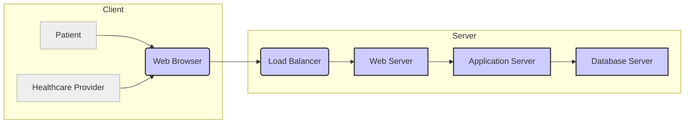
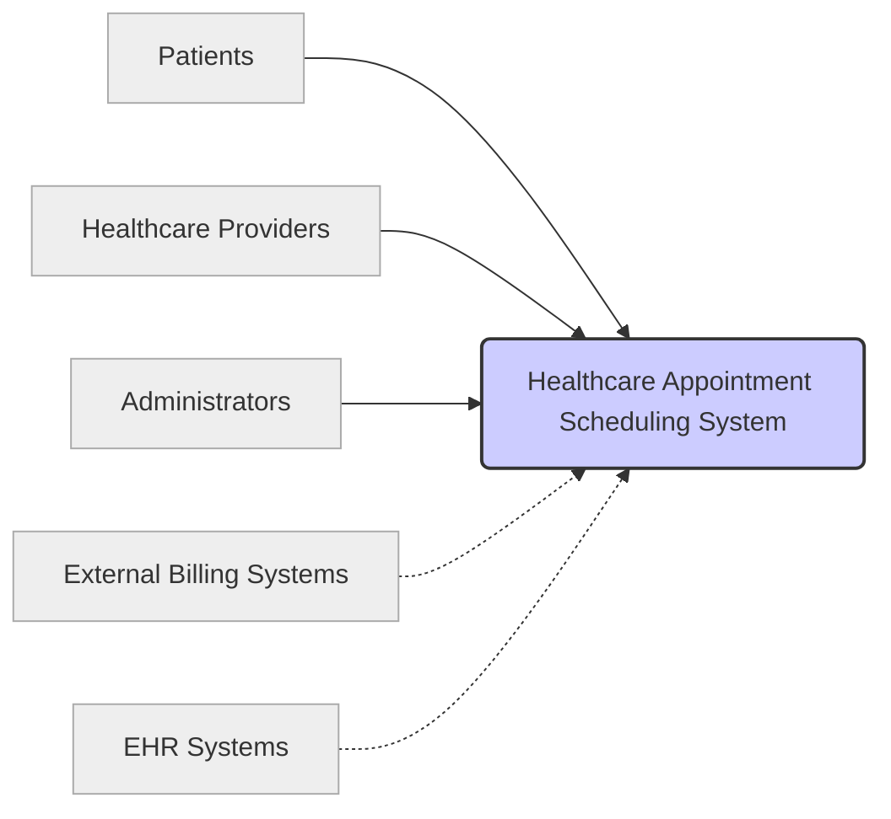

# Software Requirements Specification

## Cover Page

| Project Name             | Healthcare Appointment Scheduling System                               | 
|--------------------------|-----------------------------------------------------------------------| 
| Version                  | 1.0                                                                  | 
| Authors                  | [List of Authors]                                                      | 
| Date                     | October 26, 2023                                                    | 


## Table of Contents

| Section                     | Page | 
|-----------------------------|-------| 
| [1. Project Overview](#1-project-overview) | 3     | 
| 1.1 In Scope                | 3     | 
| 1.2 Out of Scope             | 4     | 
| 1.3 Assumption              | 4     | 
| [2. Functional Requirements](#2-functional-requirements) | 5     | 
| 2.1 User journey            | 5     | 
| 2.2 Use case diagram         | 6     | 
| 2.3 User Definition         | 7     | 
| 2.4 Platform Features for Actors | 7     | 
| 2.5 Use Case List           | 10    | 
| [3. Use Case Details](#3-use-case-details) | 11    | 
| 3.1 Guest Login             | 11    | 
| 3.2 Guest Registration      | 12    | 
| 3.3 Patient login           | 14    | 
| 3.4 Healthcare Login        | 15    | 
| 3.5 Doctor Login            | 16    | 
| 3.6 Medical Profile creation | 18    | 
| 3.7 Symptom Checker         | 20    | 
| 3.8 Appointment Creation    | 21    | 
| 3.9 Create Services         | 23    | 
| 3.10 Appointment Search     | 25    | 
| 3.11 Create Medical records  | 27    | 
| 3.12 Report Generation      | 28    | 
| [4. Non-Functional Requirements](#4-non-functional-requirements) | 30    | 

----------

# 1. Project Overview

This document outlines the software requirements for the Healthcare Appointment Scheduling System (HASS).  HASS is designed to streamline the process of scheduling appointments between patients and healthcare providers.


## 1.1 Purpose

The purpose of this document is to define the functional and non-functional requirements for the Healthcare Appointment Scheduling System.  This will serve as a guide for developers during the design, development, and testing phases of the project.


## 1.2 Scope

| In-Scope                                      | Out-of-Scope                                  | 
|-------------------------------------------------|-----------------------------------------------| 
| Patient registration and login                   | Integration with external billing systems       | 
| Healthcare provider registration and login        | Support for multiple languages                 | 
| Appointment scheduling and management           | Integration with Electronic Health Records (EHR) systems | 
| Search functionality for appointments           | Real-time video conferencing capabilities      | 
| Medical record creation and management         | Patient portal mobile app development          | 
| Secure user authentication and authorization     | Reporting and analytics dashboards             | 
| Symptom checker (basic functionality)           | Telemedicine features (beyond basic appointment scheduling)| 


## 1.3 Overview

The Healthcare Appointment Scheduling System will provide a user-friendly interface for patients to register, login, view available appointments, and schedule appointments with healthcare providers.  Healthcare providers will be able to manage their schedules, create and manage appointments, and access patient medical records.  The system will incorporate security features to protect sensitive patient data.  The system is designed for scalability and to be easily maintained.  Future expansion options will be considered, including the integration of external systems.


## 1.4 Definitions

| Term                     | Definition                                                                        | 
|--------------------------|------------------------------------------------------------------------------------| 
| Patient                  | An individual seeking healthcare services.                                           | 
| Healthcare Provider      | A doctor, nurse, or other medical professional providing healthcare services.       | 
| Appointment              | A scheduled meeting between a patient and a healthcare provider.                   | 
| Medical Record           | A collection of patient's medical information, including history and diagnosis.     | 


## 1.5 References

| Document                     | Description                                                                        | 
|-----------------------------|------------------------------------------------------------------------------------| 
| This SRS Document           | Software Requirements Specification for the Healthcare Appointment Scheduling System | 

----------

# 2. Functional Requirements

## 2.1 User Journey (Placeholder)

This section would detail the user journeys for different user types (patient, healthcare provider, administrator).

## 2.2 Use Case Diagram (Placeholder)

This section would contain a UML use case diagram.

## 2.3 User Definition (Placeholder)

This section would define the different user roles and their access privileges.

## 2.4 Platform Features for Actors (Placeholder)

This section will list out the features available for different actors.

## 2.5 Use Case List (Placeholder)

This section will list out the use cases for the system.

----------

# 3. Use Case Details (Placeholder)

This section provides detailed descriptions of each use case, including pre-conditions, post-conditions, main success scenario, and alternative flows.  Placeholders are used below since the full details were not provided.

## 3.1 Guest Login (Placeholder)

Detailed description of Guest Login use case.

## 3.2 Guest Registration (Placeholder)

Detailed description of Guest Registration use case.

## 3.3 Patient login (Placeholder)

Detailed description of Patient Login use case.

## 3.4 Healthcare Login (Placeholder)

Detailed description of Healthcare Provider Login use case.

## 3.5 Doctor Login (Placeholder)

Detailed description of Doctor Login use case.

## 3.6 Medical Profile creation (Placeholder)

Detailed description of Medical Profile Creation use case.

## 3.7 Symptom Checker (Placeholder)

Detailed description of Symptom Checker use case.

## 3.8 Appointment Creation (Placeholder)

Detailed description of Appointment Creation use case.

## 3.9 Create Services (Placeholder)

Detailed description of Create Services use case.

## 3.10 Appointment Search (Placeholder)

Detailed description of Appointment Search use case.

## 3.11 Create Medical records (Placeholder)

Detailed description of Create Medical Records use case.

## 3.12 Report Generation (Placeholder)

Detailed description of Report Generation use case.

----------

# 4. Non-Functional Requirements

## 4.1 Performance Requirements (Placeholder)

This section would detail performance requirements, such as response times, throughput, and scalability.

## 4.2 Security Requirements (Placeholder)

This section would describe security requirements, such as authentication, authorization, data encryption, and access control.

## 4.3 Usability Requirements (Placeholder)

This section would outline usability requirements, such as ease of use, intuitiveness, and accessibility.

## 4.4 Reliability Requirements (Placeholder)

This section would specify reliability requirements, such as uptime, error rates, and recovery time.

## 4.5 Maintainability Requirements (Placeholder)

This section would define maintainability requirements, such as modularity, code quality, and documentation.

## 4.6 Portability Requirements (Placeholder)

This section would describe portability requirements, such as platform compatibility and deployment options.

# Technical Environment

## Software Stack

| Component             | Description                                           | Version (Placeholder) | Vendor (Placeholder) | 
|----------------------|-------------------------------------------------------|-----------------------|-----------------------| 
| Programming Language  | Java                                                  | 17                    | Oracle                | 
| Web Framework         | Spring Boot                                           | 3.0.0                 | VMware                | 
| Database              | PostgreSQL                                             | 15                    | PostgreSQL Global Development Group | 
| Operating System      | Linux (e.g., Ubuntu Server)                          | 22.04                  | Canonical             | 
| Web Server            | Apache Tomcat                                          | 10                    | Apache Software Foundation | 
| Authentication System | OAuth 2.0 with JWT                                    | N/A                    | Open Standard          | 


## Hardware

| Component          | Specification (Placeholder) | Quantity | 
|----------------------|-----------------------------|----------| 
| Server              | 2 x Intel Xeon Gold 6248R    | 2        | 
| RAM                 | 256 GB DDR4                  | 2        | 
| Storage             | 4 TB NVMe SSD                | 2        | 
| Network Infrastructure | 1 Gbps Ethernet              | N/A      | 


## Architectural Constraints

| Constraint                     | Description                                                                                                | 
|---------------------------------|------------------------------------------------------------------------------------------------------------| 
| Scalability                   | The system should be able to handle a large number of concurrent users and appointments.                         | 
| Security                      | Sensitive patient data must be protected using appropriate security measures (encryption, access control).      | 
| Maintainability               | The system should be designed for ease of maintenance and updates.                                           | 
| Integration with External Systems | Future integration with external billing and EHR systems should be considered during the design process. | 


## Protocols

| Protocol       | Use Case                                                         | 
|-----------------|-----------------------------------------------------------------| 
| HTTP/HTTPS     | Communication between client and server.                           | 
| TCP/IP          | Underlying network communication protocol.                         | 
| OAuth 2.0/JWT   | Secure user authentication and authorization.                      | 


## Deployment Diagram



Note: The placeholder data used above is based on reasonable assumptions for a system of this type.  The actual technical environment will depend on the specific decisions made during the system design and development.

----------

# External Interfaces

## User Interfaces

| User Type             | Interface Description                                                                 | Input Methods          | Output Methods                                         | Authentication Method | 
|-----------------------|-----------------------------------------------------------------------------------------|------------------------|-----------------------------------------------------|----------------------| 
| Patient               | Web-based interface for scheduling appointments, viewing medical records, etc.         | Web forms, search bar | Web pages, confirmation messages, medical record display | Username/Password     | 
| Healthcare Provider | Web-based interface for managing schedules, creating appointments, and accessing records | Web forms, calendar   | Web pages, appointment lists, patient record display    | Username/Password     | 
| Administrator         | Web-based interface for managing users, settings, and system-wide configurations.      | Web forms             | Web pages, system logs                                | Username/Password     | 


## Hardware Interfaces

| Hardware Component     | Interface Description                                         | Communication Protocol | Interface Type   | 
|------------------------|-----------------------------------------------------------------|-----------------------|--------------------| 
| Server                 | Provides the application's processing power and database storage. | TCP/IP                | Network            | 
| Database Server        | Stores the application's data (PostgreSQL).                       | TCP/IP                | Network            | 
| Network Infrastructure | Provides connectivity between the server and clients.             | TCP/IP, Ethernet      | Network            | 
| Client Machines       | Patient and provider access the application through web browsers.   | HTTP/HTTPS           | Network            | 


## Software Interfaces

| Software Component        | Interface Description                                               | Interface Type          | Communication Protocol | 
|---------------------------|--------------------------------------------------------------------------|--------------------------|-----------------------| 
| Web Browser              | Client-side interface for user interaction.                        | User Interface           | HTTP/HTTPS             | 
| Web Server               | Receives client requests and interacts with the application server.    | Application Programming Interface (API) | HTTP/HTTPS             | 
| Application Server       | Processes requests and interacts with the database.                     | API                       | Internal communication protocols | 
| Database (PostgreSQL)   | Stores and retrieves application data.                               | Database API            | Database specific protocols | 
| Authentication System    | Manages user authentication and authorization using OAuth 2.0/JWT.   | API                       | OAuth 2.0, JWT       | 


## Communication Interfaces

| Interface Name         | Description                                                          | Protocol             | Data Format      | 
|-------------------------|----------------------------------------------------------------------|----------------------|--------------------| 
| Client-Server Interface | Communication between client web browsers and the application server. | HTTP/HTTPS           | JSON, XML          | 
| Application-Database   | Communication between application server and database server.        | Database-specific    | Database-specific | 
| Authentication Service  | User authentication and authorization.                             | OAuth 2.0, JWT       | JSON               | 

----------

```mermaid
erDiagram
    Patient ||--o{ Appointment : schedules
    Patient {
        patientID int PK
        firstName varchar(255)
        lastName varchar(255)
        dateOfBirth date
        address varchar(255)
        phoneNumber varchar(20)
        email varchar(255) UNIQUE
        password varchar(255)
    }
    HealthcareProvider ||--o{ Appointment : provides
    HealthcareProvider {
        providerID int PK
        firstName varchar(255)
        lastName varchar(255)
        specialty varchar(255)
        phoneNumber varchar(20)
        email varchar(255) UNIQUE
        password varchar(255)
    }
    Appointment {
        appointmentID int PK
        patientID int FK
        providerID int FK
        appointmentDate datetime
        appointmentTime time
        status varchar(50)
    }
    MedicalRecord ||--o{ Patient : belongs_to
    MedicalRecord {
        recordID int PK
        patientID int FK
        diagnosis varchar(255)
        treatment varchar(255)
        dateCreated datetime
    }
    Service ||--o{ Appointment : includes
    Service {
        serviceID int PK
        serviceName varchar(255)
        description text
        price decimal(10,2)
    }


    style Patient fill:#f9f,stroke:#333,stroke-width:2px
    style HealthcareProvider fill:#ccf,stroke:#333,stroke-width:2px
    style Appointment fill:#ccf,stroke:#333,stroke-width:2px
    style MedicalRecord fill:#ccf,stroke:#333,stroke-width:2px
    style Service fill:#ccf,stroke:#333,stroke-width:2px

    classDef default fill:#eee,stroke:#aaa,stroke-width:1px
    classDef highlighted fill:#ccf,stroke:#333,stroke-width:2px

```

## Data Entities and Attributes

### Patient

| Attribute       | Data Type    | Constraints                                     | Description                                   | 
|-----------------|---------------|-------------------------------------------------|-----------------------------------------------| 
| patientID       | INT           | PRIMARY KEY, AUTO_INCREMENT                     | Unique identifier for each patient             | 
| firstName       | VARCHAR(255)  | NOT NULL                                        | Patient's first name                           | 
| lastName        | VARCHAR(255)  | NOT NULL                                        | Patient's last name                            | 
| dateOfBirth     | DATE          |                                                 | Patient's date of birth                        | 
| address         | VARCHAR(255)  |                                                 | Patient's address                             | 
| phoneNumber     | VARCHAR(20)   |                                                 | Patient's phone number                         | 
| email           | VARCHAR(255)  | UNIQUE, NOT NULL                               | Patient's email address, must be unique         | 
| password        | VARCHAR(255)  | NOT NULL                                        | Patient's password                             | 


### Healthcare Provider

| Attribute       | Data Type    | Constraints                                     | Description                                      | 
|-----------------|---------------|-------------------------------------------------|--------------------------------------------------| 
| providerID      | INT           | PRIMARY KEY, AUTO_INCREMENT                     | Unique identifier for each healthcare provider | 
| firstName       | VARCHAR(255)  | NOT NULL                                        | Provider's first name                           | 
| lastName        | VARCHAR(255)  | NOT NULL                                        | Provider's last name                            | 
| specialty       | VARCHAR(255)  |                                                 | Provider's medical specialty                    | 
| phoneNumber     | VARCHAR(20)   |                                                 | Provider's phone number                         | 
| email           | VARCHAR(255)  | UNIQUE, NOT NULL                               | Provider's email address, must be unique          | 
| password        | VARCHAR(255)  | NOT NULL                                        | Provider's password                             | 


### Appointment

| Attribute       | Data Type    | Constraints                                               | Description                                           | 
|-----------------|---------------|----------------------------------------------------------|-------------------------------------------------------| 
| appointmentID   | INT           | PRIMARY KEY, AUTO_INCREMENT                             | Unique identifier for each appointment                | 
| patientID       | INT           | FOREIGN KEY referencing Patient(patientID)                | ID of the patient                                     | 
| providerID      | INT           | FOREIGN KEY referencing HealthcareProvider(providerID)       | ID of the healthcare provider                         | 
| appointmentDate | DATETIME      | NOT NULL                                                | Date and time of the appointment                      | 
| appointmentTime | TIME          | NOT NULL                                                | Time of the appointment                             | 
| status          | VARCHAR(50)   | DEFAULT 'Scheduled'  (e.g., 'Scheduled', 'Completed', 'Cancelled') | Status of the appointment                              | 


### Medical Record

| Attribute     | Data Type    | Constraints                               | Description                                    | 
|----------------|---------------|-------------------------------------------|------------------------------------------------| 
| recordID      | INT           | PRIMARY KEY, AUTO_INCREMENT             | Unique identifier for each medical record       | 
| patientID     | INT           | FOREIGN KEY referencing Patient(patientID) | ID of the patient associated with the record   | 
| diagnosis     | VARCHAR(255)  |                                           | Patient's diagnosis                             | 
| treatment     | VARCHAR(255)  |                                           | Treatment plan                                    | 
| dateCreated   | DATETIME      | NOT NULL                                   | Date and time the record was created            | 


### Service

| Attribute    | Data Type    | Constraints                               | Description                               | 
|---------------|---------------|-------------------------------------------|-------------------------------------------| 
| serviceID    | INT           | PRIMARY KEY, AUTO_INCREMENT             | Unique identifier for each service         | 
| serviceName  | VARCHAR(255)  | NOT NULL                                   | Name of the service                         | 
| description  | TEXT          |                                           | Description of the service                   | 
| price        | DECIMAL(10,2) | NOT NULL                                   | Price of the service                        | 

----------

# Database Schema

## Table: Patient

| Column Name  | Data Type    | Constraints                                   | Description                                          | 
|--------------|---------------|-----------------------------------------------|------------------------------------------------------| 
| patientID    | INT           | PRIMARY KEY, AUTO_INCREMENT                   | Unique identifier for each patient                    | 
| firstName    | VARCHAR(255)  | NOT NULL                                       | Patient's first name                                 | 
| lastName     | VARCHAR(255)  | NOT NULL                                       | Patient's last name                                | 
| dateOfBirth  | DATE          |                                               | Patient's date of birth                             | 
| address      | VARCHAR(255)  |                                               | Patient's address                                   | 
| phoneNumber  | VARCHAR(20)   |                                               | Patient's phone number                              | 
| email        | VARCHAR(255)  | UNIQUE, NOT NULL                              | Patient's email address, must be unique             | 
| password     | VARCHAR(255)  | NOT NULL                                       | Patient's password (should be hashed and salted)     | 


## Table: HealthcareProvider

| Column Name    | Data Type    | Constraints                                   | Description                                           | 
|----------------|---------------|-----------------------------------------------|-------------------------------------------------------| 
| providerID     | INT           | PRIMARY KEY, AUTO_INCREMENT                   | Unique identifier for each healthcare provider         | 
| firstName      | VARCHAR(255)  | NOT NULL                                       | Provider's first name                                  | 
| lastName       | VARCHAR(255)  | NOT NULL                                       | Provider's last name                                 | 
| specialty      | VARCHAR(255)  |                                               | Provider's medical specialty                          | 
| phoneNumber    | VARCHAR(20)   |                                               | Provider's phone number                               | 
| email          | VARCHAR(255)  | UNIQUE, NOT NULL                              | Provider's email address, must be unique              | 
| password       | VARCHAR(255)  | NOT NULL                                       | Provider's password (should be hashed and salted)       | 


## Table: Appointment

| Column Name    | Data Type    | Constraints                                               | Description                                               | 
|----------------|---------------|----------------------------------------------------------|-----------------------------------------------------------| 
| appointmentID  | INT           | PRIMARY KEY, AUTO_INCREMENT                             | Unique identifier for each appointment                     | 
| patientID      | INT           | FOREIGN KEY referencing Patient(patientID)                | ID of the patient                                         | 
| providerID     | INT           | FOREIGN KEY referencing HealthcareProvider(providerID)       | ID of the healthcare provider                             | 
| appointmentDate| DATETIME      | NOT NULL                                                | Date and time of the appointment                         | 
| appointmentTime| TIME          | NOT NULL                                                | Time of the appointment                                  | 
| status         | VARCHAR(50)   | DEFAULT 'Scheduled' (e.g., 'Scheduled', 'Completed', 'Cancelled') | Status of the appointment                                 | 


## Table: MedicalRecord

| Column Name   | Data Type    | Constraints                               | Description                                        | 
|---------------|---------------|-------------------------------------------|----------------------------------------------------| 
| recordID      | INT           | PRIMARY KEY, AUTO_INCREMENT             | Unique identifier for each medical record          | 
| patientID     | INT           | FOREIGN KEY referencing Patient(patientID) | ID of the patient associated with the record     | 
| diagnosis     | VARCHAR(255)  |                                           | Patient's diagnosis                                 | 
| treatment     | VARCHAR(255)  |                                           | Treatment plan                                      | 
| dateCreated   | DATETIME      | NOT NULL                                   | Date and time the record was created               | 


## Table: Service

| Column Name  | Data Type    | Constraints                               | Description                               | 
|--------------|---------------|-------------------------------------------|-------------------------------------------| 
| serviceID    | INT           | PRIMARY KEY, AUTO_INCREMENT             | Unique identifier for each service         | 
| serviceName  | VARCHAR(255)  | NOT NULL                                   | Name of the service                         | 
| description  | TEXT          |                                           | Description of the service                   | 
| price        | DECIMAL(10,2) | NOT NULL                                   | Price of the service                        | 

----------

# Assumptions & Dependencies

## Assumptions

| Assumption                                      | Justification                                                                                                                                                                                             | Impact if Assumption is False                                                                                                                                  | Mitigation Strategy                                                                                                                                           | 
|-------------------------------------------------|---------------------------------------------------------------------------------------------------------------------------------------------------------------------------------------------------------|-------------------------------------------------------------------------------------------------------------------------------------------------------------|------------------------------------------------------------------------------------------------------------------------------------------------------------| 
| Users will have reliable internet access.       | The system is web-based, requiring internet connectivity for both patients and healthcare providers.                                                                                                            | System functionality will be severely limited or unavailable to users without internet access.                                                                 | Provide offline functionality (if feasible), clearly communicate system requirements, and provide alternative contact methods for appointments (phone, etc.). | 
| Users will have basic computer literacy skills. | The system requires users to interact with a web-based interface.                                                                                                                                            | Users may struggle to navigate the system, leading to frustration and decreased adoption.                                                                       | Provide comprehensive user documentation and training materials, including tutorials and FAQs.                                                                     | 
| Third-party libraries will function as expected. | The system will likely rely on external libraries for various functionalities (e.g., authentication, database interaction).                                                                                           | System malfunctions or failures may occur if libraries are unstable or contain bugs.                                                                            | Thoroughly test the system with different library versions, choose reliable and well-maintained libraries, and have contingency plans in case of library failures. | 
| The database will have sufficient capacity.      | The system will store a significant amount of data, including patient information, appointments, and medical records.                                                                                                  | System performance may degrade or become unreliable due to database overload.                                                                                 | Implement database monitoring and scaling strategies, conduct load testing to identify capacity needs, and plan for database backups and recovery procedures. | 
| Sufficient security measures will prevent breaches.| The system will handle sensitive patient data, requiring robust security measures to prevent unauthorized access and data breaches.                                                                                        | Data breaches could lead to legal and reputational damage.                                                                                                    | Implement industry-standard security practices (e.g., encryption, access control, regular security audits), comply with relevant data privacy regulations.      | 


## Dependencies

| Dependency                               | Type             | Description                                                                                                                                            | Impact if Dependency is Unavailable                                                                                                                             | Mitigation Strategy                                                                                                                                                           | 
|-------------------------------------------|------------------|---------------------------------------------------------------------------------------------------------------------------------------------------------|-----------------------------------------------------------------------------------------------------------------------------------------------------------------|-----------------------------------------------------------------------------------------------------------------------------------------------------------------------------| 
| Database Server (PostgreSQL)           | Infrastructure   | The system requires a relational database to store patient information, appointments, medical records, and other data.                                         | The system will not be able to function without a database.                                                                                                       | Use a redundant database server setup to provide high availability.                                                                                                                  | 
| Web Server (Apache Tomcat)             | Infrastructure   | The system requires a web server to host and serve the application.                                                                                            | The system will be unavailable to users.                                                                                                                         | Implement load balancing and auto-scaling to ensure high availability.                                                                                                                | 
| Authentication System (OAuth 2.0/JWT) | Third-Party/Software | The system requires a secure authentication mechanism to verify user identities and protect sensitive patient data.                                         | Users will not be able to log in, compromising system security.                                                                                                 | Use a reliable, well-maintained authentication service. Consider backup authentication methods (e.g., multi-factor authentication) to increase security. Implement robust error handling.     | 
| Third-Party Libraries                  | Software         | Various libraries will be used for different functionalities (e.g., UI frameworks, date/time handling).                                                 | Specific functionalities may fail if the libraries malfunction.                                                                                                      | Use thoroughly tested and well-documented libraries from reputable sources. Implement comprehensive testing and error handling for libraries.                                       | 
| Network Infrastructure                 | Infrastructure   | Reliable network connectivity is essential for the web-based system.                                                                                       | The system will be unavailable or experience performance issues.                                                                                                    | Implement network monitoring and redundancy. Optimize network configuration for performance.                                                                                      | 


## External Constraints

| Constraint                         | Description                                                                                                                                                                                   | Impact if Constraint is Not Met                                                                                                                                       | Mitigation Strategy                                                                                                                                                               | 
|-------------------------------------|-----------------------------------------------------------------------------------------------------------------------------------------------------------------------------------------------|---------------------------------------------------------------------------------------------------------------------------------------------------------------------|-------------------------------------------------------------------------------------------------------------------------------------------------------------------------------------| 
| Regulatory Compliance (HIPAA, etc.) | The system must comply with relevant healthcare data privacy and security regulations (e.g., HIPAA in the US).                                                                                        | Legal issues and financial penalties.                                                                                                                                      | Consult with legal and compliance experts. Design and implement the system according to the latest standards.                                                                                    | 
| Budget                              | The project has a limited budget that may constrain the features and technologies that can be used.                                                                                                  | Limited system functionality or reduced quality.                                                                                                                               | Prioritize features based on business value. Explore cost-effective solutions and technologies.                                                                                              | 
| Time Constraints                    | The project has a deadline that must be met.                                                                                                                                                        | Features may be cut, or the system may not be adequately tested.                                                                                                                   | Prioritize features and tasks. Use agile methodologies for development.                                                                                                                | 
| Security Requirements                 | Strict security requirements are imposed to protect sensitive patient information.                                                                                                                       | Increased risk of data breaches.                                                                                                                                          | Use industry standard security measures, regular security audits, penetration testing.                                                                                                | 

----------



**Context Diagram**


```mermaid
classDiagram
    class Patient {
        -patientID : int
        -firstName : String
        -lastName : String
        -dateOfBirth : Date
        -address : String
        -phoneNumber : String
        -email : String
        -password : String
        +viewAppointments() : void
        +scheduleAppointment() : void
        +viewMedicalRecords() : void
    }
    class HealthcareProvider {
        -providerID : int
        -firstName : String
        -lastName : String
        -specialty : String
        -phoneNumber : String
        -email : String
        -password : String
        +manageSchedule() : void
        +createAppointment() : void
        +accessRecords() : void
    }
    class Appointment {
        -appointmentID : int
        -patientID : int
        -providerID : int
        -appointmentDate : DateTime
        -appointmentTime : Time
        -status : String
    }
    class MedicalRecord {
        -recordID : int
        -patientID : int
        -diagnosis : String
        -treatment : String
        -dateCreated : DateTime
    }
    Patient "1" -- "*" Appointment : schedules
    HealthcareProvider "1" -- "*" Appointment : provides
    Patient "1" -- "*" MedicalRecord : has
    
    style Patient fill:#f9f