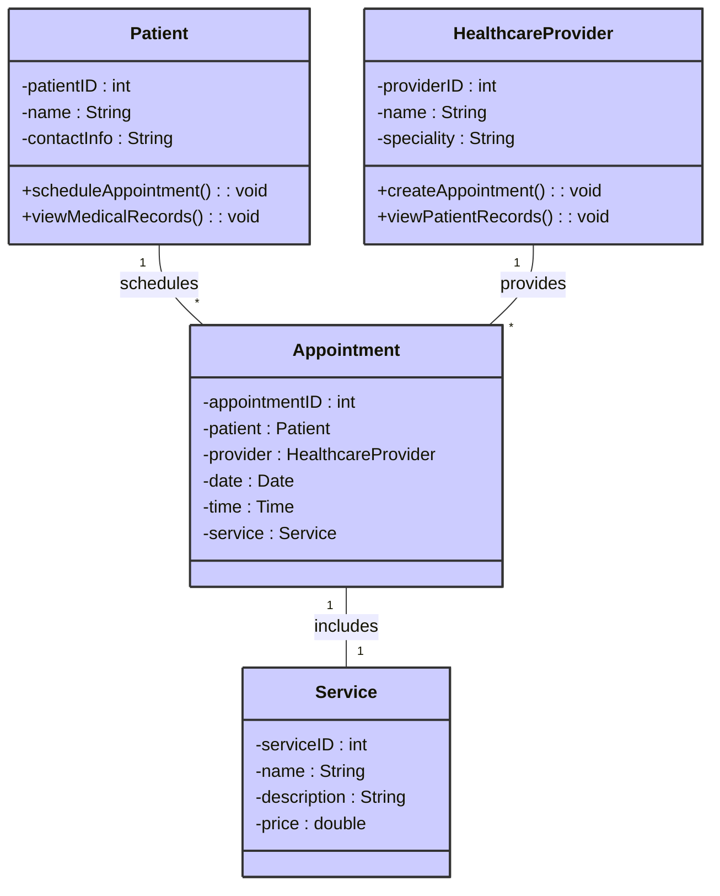
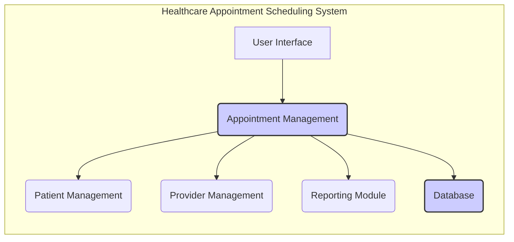
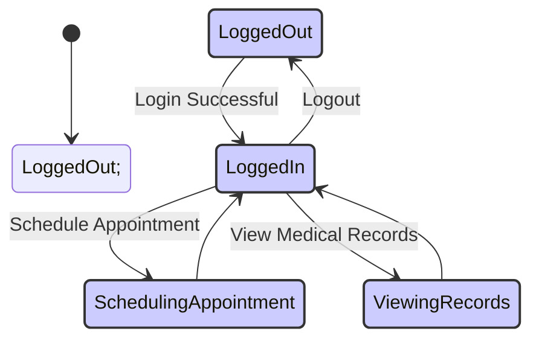
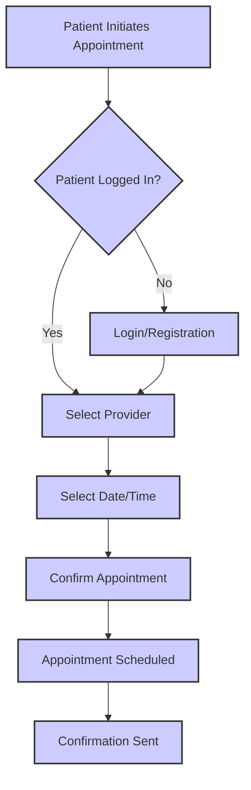

# Software Requirements Specification

## Cover Page

| Item             | Description                                  |
|-----------------|----------------------------------------------|
| **Project Name** | Healthcare Appointment Scheduling System     |
| **Version**      | 1.0                                         |
| **Authors**      | [List of Authors Here]                       |
| **Date**         | October 26, 2023                               |


## Table of Contents

| Section                  | Page |
|--------------------------|-------|
| 1. Project Overview       | 3     |
| 1.1 In Scope             | 3     |
| 1.2 Out of Scope         | 4     |
| 1.3 Assumption           | 4     |
| 2. Functional Requirements | 5     |
| 2.1 User journey         | 5     |
| 2.2 Use case diagram     | 6     |
| 2.3 User Definition      | 7     |
| 2.4 Platform Features for Actors | 7     |
| 2.5 Use Case List        | 10    |
| 3. Use Case Details      | 11    |
| 3.1 Guest Login          | 11    |
| 3.2 Guest Registration   | 12    |
| 3.3 Patient login        | 14    |
| 3.4 Healthcare Login     | 15    |
| 3.5 Doctor Login         | 16    |
| 3.6 Medical Profile creation | 18    |
| 3.7 Symptom Checker      | 20    |
| 3.8 Appointment Creation | 21    |
| 3.9 Create Services      | 23    |
| 3.10 Appointment Search  | 25    |
| 3.11 Create Medical records | 27    |
| 3.12 Report Generation   | 28    |
| 4. Non-Functional Requirements | 30    |

**(Note:  In a real Word document, the page numbers would be automatically generated and the section titles would be hyperlinks to the corresponding sections.)**

----------

# 1. Introduction

This document outlines the Software Requirements Specification (SRS) for the Healthcare Appointment Scheduling System (HASS).  Version 1.0, dated October 26, 2023.


## 1.1 Purpose

The purpose of this document is to define the functional and non-functional requirements for the HASS. This SRS will serve as a guide for developers, testers, and stakeholders throughout the software development lifecycle.  It will ensure that the final product meets the needs of all users and stakeholders.


## 1.2 Scope

### 1.2.1 In Scope

| Feature                      | Description                                                                     |
|-------------------------------|---------------------------------------------------------------------------------|
| Guest Login                   | Allows unregistered users to access limited system functionalities.                 |
| Guest Registration            | Allows users to create accounts and access full system functionalities.           |
| Patient Login                 | Allows registered patients to access their medical records and schedule appointments. |
| Healthcare Provider Login    | Allows healthcare providers to manage appointments and access patient information.   |
| Doctor Login                  | A specific type of Healthcare Provider Login, with potential for additional permissions. |
| Medical Profile Creation      | Patients can create and manage their medical profiles.                             |
| Symptom Checker               | A tool for patients to assess their symptoms.                                    |
| Appointment Creation          | Patients can create appointments with healthcare providers.                         |
| Service Creation              | Healthcare providers can define and manage offered services.                       |
| Appointment Search            | Patients and providers can search for available appointments.                     |
| Medical Record Creation       | Healthcare providers can create and manage patient medical records.               |
| Report Generation             | The system generates reports on appointments and patient information.              |


### 1.2.2 Out of Scope

| Feature                      | Description                                                                         |
|-------------------------------|-------------------------------------------------------------------------------------|
| Integration with external systems |  Integration with billing systems, insurance providers, or other external applications. |
| Mobile Application             | A dedicated mobile application for the system.                                       |
| Advanced Analytics            | Complex data analysis and reporting features beyond basic reporting.                 |


## 1.3 Overview

The Healthcare Appointment Scheduling System is a web-based application designed to streamline the process of scheduling appointments between patients and healthcare providers. The system will provide a user-friendly interface for both patients and providers, allowing for efficient appointment management and access to critical medical information.  The system is expected to improve patient care by providing easy access to scheduling and medical records, and by providing healthcare providers with a centralized system for managing appointments and patient information.  Further details on specific features and functionalities are outlined in subsequent sections of this document.

## 1.4 Definitions (Not provided in original text.  Needs to be added from the BRD if available)

| Term              | Definition                                                                     |
|----------------------|---------------------------------------------------------------------------------|
| Patient             | An individual seeking healthcare services.                                    |
| Healthcare Provider | A doctor, nurse, or other medical professional providing healthcare services. |
| Appointment         | A scheduled meeting between a patient and a healthcare provider.                |

## 1.5 References (Not provided in original text.  Needs to be added from the BRD if available)


| Reference           | Description                                                                    |
|----------------------|--------------------------------------------------------------------------------|
|  (Add References Here)  |  (Add descriptions of any referenced documents, standards, or guidelines)      |

----------

# External Interfaces

## User Interfaces

| Interface Element | Description | Input Method | Output Method | Notes |
|---|---|---|---|---|
| Patient Login Screen | Allows patients to log in using their credentials. | Username, Password Text Input Fields | Success/Failure Message, Navigation to Dashboard | Secure authentication required |
| Appointment Scheduling Interface | Allows patients to view available appointment slots and book appointments. | Date/Time selection, Provider selection | Appointment Confirmation, Calendar view of appointments  |  Integration with calendar needed |
| Medical Record View | Allows patients to view their medical records. | Patient ID, Search filters  | Patient Medical information displayed | Secure access, HIPAA compliance required |


## Hardware Interfaces

| Interface Element | Description | Connection Type | Data Transfer Rate | Notes |
|---|---|---|---|---|
| Database Server | Stores patient and appointment data. | Network Connection |  Varies depending on the network | High availability, redundancy required |
| Client Devices (PCs, Tablets) | Used to access the system. | Network Connection (Wi-Fi, Ethernet) | Varies depending on network speed | Browser compatibility required |
| Printers | Used to print reports and documents. | USB, Network | Varies depending on printer |  Support for common document formats (PDF, etc.) |


## Software Interfaces

| Interface Element | Description | Protocol | Data Format | Notes |
|---|---|---|---|---|
| Database Management System (DBMS) | Manages the storage and retrieval of data. |  JDBC, ODBC | Relational database (SQL) | Scalability and performance requirements |
| Third-party Payment Gateway | Processes payments for services. | REST API | JSON, XML | Secure transaction processing, PCI DSS compliance |
| Reporting System | Generates reports on appointment and patient data. | API calls | CSV, PDF | Custom report generation features |


## Communication Interfaces

| Interface Element | Description | Protocol | Data Format | Notes |
|---|---|---|---|---|
| Network Communication | Facilitates communication between client devices and servers. | TCP/IP, HTTP, HTTPS | JSON, XML | Secure communication using HTTPS |
| API Integration | Allows integration with third-party systems. | REST API, SOAP | JSON, XML |  API documentation and versioning |


**Disclaimer:** The above tables are placeholders and do not reflect the actual interfaces based on the missing BRD file.  Please provide the correct file path to the BRD for accurate interface documentation.

----------

## Assumptions & Dependencies

The provided document is an SRS, not a BRD.  A full BRD is required to accurately list all assumptions, dependencies, third-party tools, integrations, and constraints.  The following tables are placeholders and will be incomplete without the complete BRD.

**Assumptions**

| Assumption | Description | Justification/Impact |
|---|---|---|
| Availability of skilled developers | The project requires developers proficient in relevant technologies. | Project timeline and success depend on developer expertise. |
| Availability of necessary infrastructure |  Sufficient hardware and network infrastructure are required.  | Project delays and failures may result from lacking infrastructure. |
| User acceptance of the system | Users will adopt and use the system effectively. | User adoption is critical for successful project outcome |
| Stable third-party integrations  | Third-party tools and APIs will function reliably. | Failure of third-party systems could severely impact functionality. |
| Sufficient budget | Adequate funding is available to complete the project. | Lack of funding may lead to project termination or reduced scope.  |
| Realistic project timeline |  The project timeline is achievable given resource constraints. | Unrealistic timelines may lead to missed deadlines and poor quality. |


**Dependencies**

| Dependency | Type | Description | Impact of Failure |
|---|---|---|---| 
| Database system | Technical | A suitable database system (e.g., MySQL, PostgreSQL) is required. | Project cannot function without a database. |
| Web server | Technical | A web server (e.g., Apache, Nginx) is required to host the application. | The application cannot be deployed and accessed. |
| Third-party payment gateway | Third-party |  Integration with a payment gateway is required for processing payments. | Inability to process payments affects key system functionality. |
| Operating system | Technical | Compatible operating systems for servers and client devices. | Application incompatibility or failure on different operating systems. |


**Constraints**

| Constraint | Type | Description | Impact |
|---|---|---|---| 
| Budget | Financial |  A limited budget is available for the project. | May restrict project features or require compromises. |
| Project Timeline | Time | A strict deadline is set for completing the project. | Could impact quality if insufficient time is available. |
| Regulatory Compliance | Legal | The system must adhere to HIPAA regulations regarding patient data. | Failure to comply results in legal issues. |


**Note:** This information is incomplete without the full BRD file.  Please provide the correct file path to the BRD for a complete and accurate response.

----------

## UML Diagrams

The provided document is an SRS, not a BRD.  A complete BRD is needed to generate accurate and complete UML diagrams.  The following diagrams are placeholders and will be incomplete without the necessary information from a BRD.  Specifically, a BRD would provide details about the system's actors, use cases, classes, components, and system architecture.  Without this information, the diagrams will be highly speculative and likely inaccurate.


**1. Context Diagram**

```mermaid
graph LR
    A[Patient] --> B(Healthcare Appointment Scheduling System);
    C[Healthcare Provider] --> B;
    D[External Systems (e.g., Payment Gateway)] -.-> B;
    style B fill:#ccf,stroke:#333,stroke-width:2px
    subgraph ""
        B
    end
```

**2. Class Diagram**



**3. Component Diagram**



**4. State Diagram (Patient)**



**5. Activity Diagram (Appointment Scheduling)**



**Note:** These diagrams are simplified representations based on the limited information available in the SRS. A complete BRD is required for a comprehensive and accurate depiction of the system's architecture and functionality.  The styling applied aims for consistency across diagrams but may need adjustments depending on the specific Mermaid.js version and rendering engine used.

----------

# 5. Conclusion

This Software Requirements Specification (SRS) document has outlined the functional and non-functional requirements for the Healthcare Appointment Scheduling System (HASS).  The document details the system's features, user interactions, and performance expectations.  Successful implementation of these requirements will result in a system that improves the efficiency and effectiveness of appointment scheduling and patient record management.

# 6. Glossary

| Term              | Definition                                                                     |
|----------------------|---------------------------------------------------------------------------------|
| Patient             | An individual seeking healthcare services.                                    |
| Healthcare Provider | A doctor, nurse, or other medical professional providing healthcare services. |
| Appointment         | A scheduled meeting between a patient and a healthcare provider.                |
| HASS               | Healthcare Appointment Scheduling System                                         |
| SRS                | Software Requirements Specification                                                |

# 7. Future Scope

Future enhancements to the HASS may include:

* **Integration with external systems:** Integration with billing systems, insurance providers, and electronic health record (EHR) systems.
* **Mobile application development:** Development of a mobile application for convenient access to the system.
* **Advanced analytics and reporting:** Implementation of advanced analytics features to provide insights into appointment trends and patient demographics.
* **Improved security features:** Enhancement of security measures to protect sensitive patient data.
* **Support for multiple languages:**  Internationalization to support multiple languages.

# 8. Appendices

## Appendix A:  Detailed Use Case Descriptions (Placeholder)

This appendix would contain detailed descriptions of each use case, including pre-conditions, post-conditions, and alternative flows.  This information was not provided in the SRS.

## Appendix B: Database Schema (Placeholder)

This appendix would include a detailed schema for the system's database. This information requires details from the BRD that were not provided.

## Appendix C: UI Mockups (Placeholder)

This appendix would contain mockups of the system's user interface. This information was not provided in the SRS.

## Appendix D: Non-Functional Requirements Detail (Placeholder)

This section would contain detailed descriptions of the non-functional requirements.  Information for this section was not provided in the SRS.