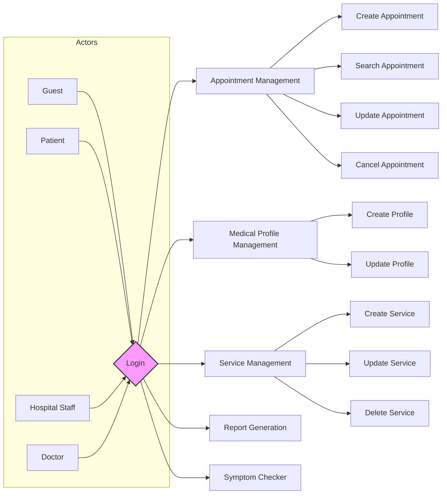
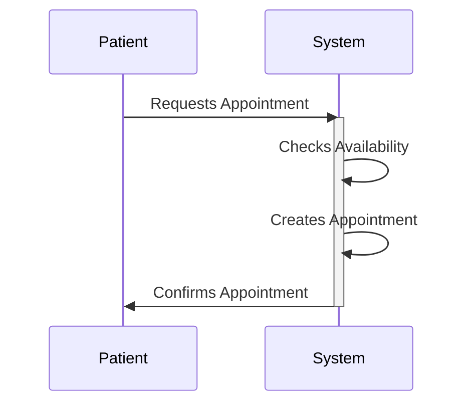
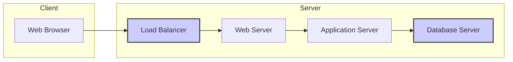
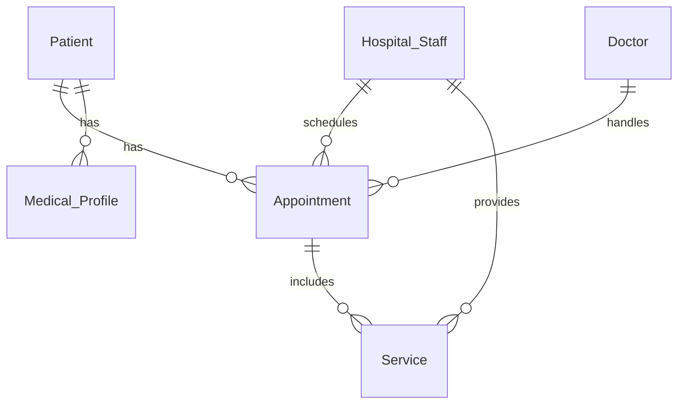
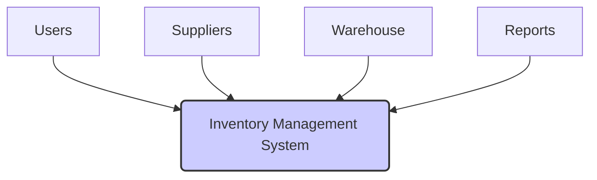
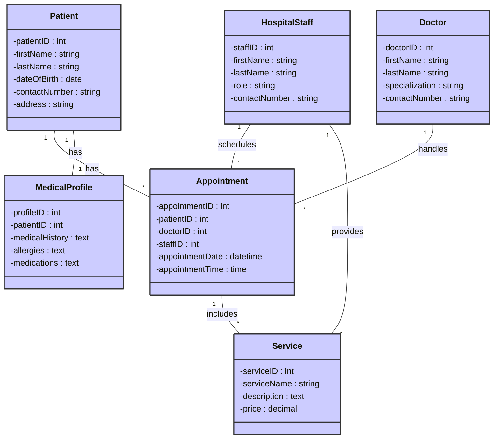
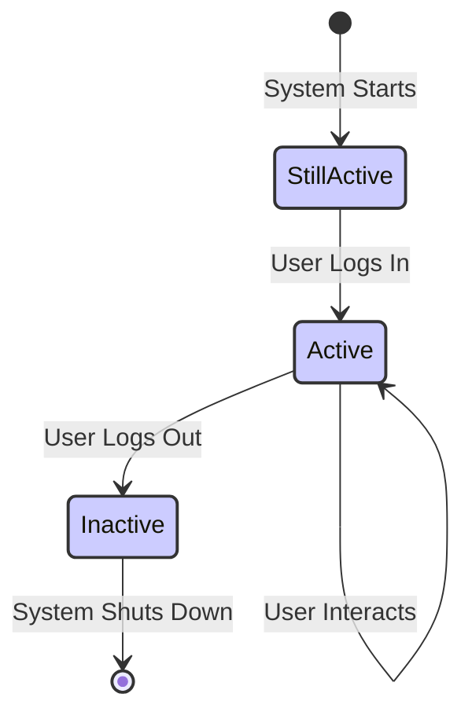
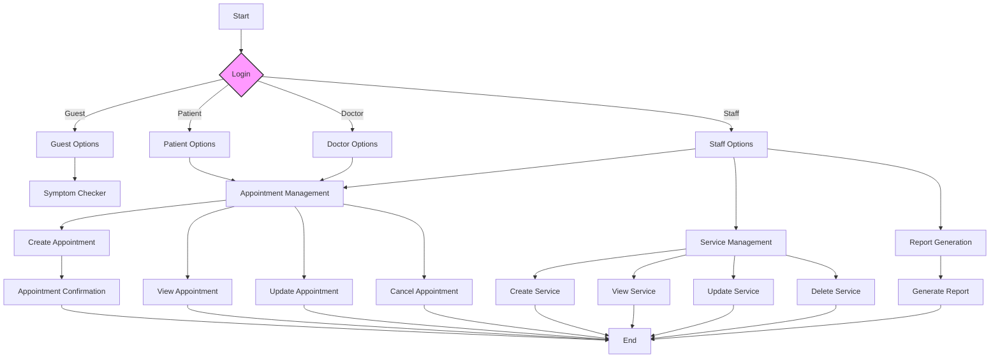

# Software Requirements Specification

## 1. Introduction

This document outlines the requirements for a new Inventory Management System (IMS). The IMS will streamline the process of tracking inventory, improving efficiency and reducing costs.

### 1.1 Purpose

The purpose of this document is to define the functional and non-functional requirements for the development of a new Inventory Management System (IMS). This system will replace the existing, outdated system and provide enhanced capabilities for inventory tracking, management, and reporting.

### 1.2 Scope

| In-Scope                     | Out-of-Scope                                  |
|-------------------------------|-------------------------------------------------|
| Inventory tracking            | Integration with external accounting software    |
| Stock level alerts            | Automated ordering from suppliers                |
| Reporting and analysis       | Mobile application interface                    |
| User management              | Integration with third-party logistics providers |
| Data backup and recovery      | Advanced analytics and forecasting capabilities   |
| Supplier information management |  Integration with Point of Sale (POS) systems  |

### 1.3 Overview

The new IMS will be a web-based application accessible to authorized personnel. It will provide a central repository for all inventory data, allowing for real-time tracking and management. The system will include features for managing stock levels, generating reports, and providing alerts for low stock situations. The system will be developed using modern technologies to ensure scalability, reliability, and maintainability. This document provides a detailed description of all functional and non-functional requirements for the system.

## 2. Functional Requirements

### 2.1 Functional Requirements Table

| ID       | Description                                                                     | Actor(s)           | Priority |
|----------|---------------------------------------------------------------------------------|--------------------|----------|
| Gen 001  | Guest Login                                                                     | Guest               | High      |
| Gen 002  | Healthcare Login                                                              | Hospital Staff      | High      |
| Gen 003  | Guest Registration                                                            | Guest               | High      |
| B2C 001  | Patient Login                                                                  | Patient             | High      |
| B2B 001  | Doctor Login                                                                   | Doctor              | High      |
| B2C 002  | Symptom Checker                                                               | Patient             | Medium    |
| B2C 003  | Appointment Creation                                                          | Patient             | High      |
| B2C 004  | Medical Profile Creation                                                      | Patient, Doctor, Hospital Staff | High      |
| B2C 005  | Create Services                                                              | Hospital Staff      | High      |
| B2C 006  | Appointment Search                                                            | Hospital Staff, Doctor | High      |
| B2C 007  | Create Medical Records                                                        | Doctor, Hospital Staff | High      |
| Gen 004  | Report Generation                                                             | Hospital Staff      | Medium    |

### 2.2 Use Case Diagrams





## 3. Technical Environment

### 3.1 Software Stack

| Component          | Technology                               | Version (Example) | Notes                                                                 |
|----------------------|-------------------------------------------|--------------------|-------------------------------------------------------------------------|
| Frontend Framework   | React, Angular, or Vue.js                 | v18.2              | Choice depends on project requirements and developer expertise.        |
| Backend Framework    | Node.js with Express, Spring Boot, or Django | v16.17.0           | Choice depends on project requirements and developer expertise.        |
| Database            | PostgreSQL, MySQL, or MongoDB             | v15, v8.0, v6.0     | Choice depends on data model and scalability requirements.             |
| Server              | Apache Tomcat, Nginx, or IIS              | 9.0, 1.24.0, 10.0  | Choice depends on project requirements and infrastructure.              |
| Operating System    | Linux (e.g., Ubuntu, CentOS), Windows Server | 22.04, 7           | Choice depends on project requirements and infrastructure.              |
| Version Control     | Git                                      | 2.39.2             | Essential for collaborative development.                               |
| CI/CD              | Jenkins, GitLab CI, or GitHub Actions       | N/A                | To automate build, testing, and deployment processes.                 |

### 3.2 Hardware

| Component          | Specifications                                  | Notes                                                                     |
|----------------------|-----------------------------------------------|--------------------------------------------------------------------------|
| Servers             | Multiple servers for load balancing and redundancy | Cloud-based or on-premises.  Specifications depend on expected load.       |
| Database Servers    | High-performance servers with sufficient storage     | Must meet the requirements of the chosen database technology.                |
| Network Infrastructure| High-bandwidth network with sufficient security    |  To ensure reliable communication between servers and clients.               |

### 3.3 Architectural Constraints

| Constraint           | Description                                                             | Mitigation Strategy                                          |
|-----------------------|-------------------------------------------------------------------------|--------------------------------------------------------------|
| Scalability          | System must handle increasing numbers of users and data.                 | Use cloud-based infrastructure, horizontal scaling, etc.       |
| Security             | System must protect sensitive data from unauthorized access.              | Implement robust authentication and authorization mechanisms. |
| Maintainability       | System must be easy to maintain and update.                           | Use modular design, well-documented code, and CI/CD.         |
| Performance          | System must respond quickly to user requests.                            | Optimize database queries, use caching, etc.                   |

### 3.4 Protocols

| Protocol            | Purpose                                                    |
|-----------------------|---------------------------------------------------------|
| HTTP/HTTPS          | Communication between client and server.                     |
| TCP/IP              | Network communication.                                     |
| TLS/SSL             | Secure communication.                                       |
| Database Protocol   | Communication between application and database (e.g., PostgreSQL, MySQL). |

### 3.5 Deployment Diagram



## 4. Database Schema

### 4.1 Entity-Relationship Diagram



### 4.2 Tables

#### 4.2.1 Patient

| Column Name    | Data Type    | Constraints                                   |
|-----------------|---------------|-----------------------------------------------|
| PatientID       | INT           | PRIMARY KEY, AUTO_INCREMENT                    |
| FirstName       | VARCHAR(255)  | NOT NULL                                      |
| LastName        | VARCHAR(255)  | NOT NULL                                      |
| DateOfBirth     | DATE           |                                               |
| ContactNumber   | VARCHAR(20)   |                                               |
| Address         | VARCHAR(255)  |                                               |

#### 4.2.2 Doctor

| Column Name      | Data Type    | Constraints                                   |
|-------------------|---------------|-----------------------------------------------|
| DoctorID         | INT           | PRIMARY KEY, AUTO_INCREMENT                    |
| FirstName        | VARCHAR(255)  | NOT NULL                                      |
| LastName         | VARCHAR(255)  | NOT NULL                                      |
| Specialization   | VARCHAR(255)  |                                               |
| ContactNumber    | VARCHAR(20)   |                                               |

#### 4.2.3 Hospital_Staff

| Column Name     | Data Type    | Constraints                                   |
|------------------|---------------|-----------------------------------------------|
| StaffID          | INT           | PRIMARY KEY, AUTO_INCREMENT                    |
| FirstName        | VARCHAR(255)  | NOT NULL                                      |
| LastName         | VARCHAR(255)  | NOT NULL                                      |
| Role             | VARCHAR(255)  |                                               |
| ContactNumber    | VARCHAR(20)   |                                               |

#### 4.2.4 Appointment

| Column Name      | Data Type    | Constraints                                               |
|-------------------|---------------|----------------------------------------------------------|
| AppointmentID     | INT           | PRIMARY KEY, AUTO_INCREMENT                               |
| PatientID         | INT           | FOREIGN KEY (Patient), NOT NULL                            |
| DoctorID          | INT           | FOREIGN KEY (Doctor), NOT NULL                             |
| StaffID           | INT           | FOREIGN KEY (Hospital_Staff), NOT NULL                      |
| AppointmentDate   | DATETIME       | NOT NULL                                                |
| AppointmentTime   | TIME           | NOT NULL                                                |

#### 4.2.5 Service

| Column Name     | Data Type    | Constraints                                   |
|------------------|---------------|-----------------------------------------------|
| ServiceID        | INT           | PRIMARY KEY, AUTO_INCREMENT                    |
| ServiceName      | VARCHAR(255)  | NOT NULL                                      |
| Description      | TEXT           |                                               |
| Price            | DECIMAL(10,2) |                                               |

#### 4.2.6 Medical_Profile

| Column Name     | Data Type    | Constraints                                       |
|------------------|---------------|---------------------------------------------------| 
| ProfileID        | INT           | PRIMARY KEY, AUTO_INCREMENT                       |
| PatientID        | INT           | FOREIGN KEY (Patient), UNIQUE, NOT NULL          |
| MedicalHistory   | TEXT           |                                                   |
| Allergies        | TEXT           |                                                   |
| Medications      | TEXT           |                                                   |

### 4.3 Foreign Keys

* **Appointment**: `PatientID` references `Patient`.`PatientID`
* **Appointment**: `DoctorID` references `Doctor`.`DoctorID`
* **Appointment**: `StaffID` references `Hospital_Staff`.`StaffID`
* **Medical_Profile**: `PatientID` references `Patient`.`PatientID`

### 4.4 Data Validation Rules

* All `VARCHAR` fields should have appropriate length limits based on expected data.
* `DateOfBirth` should be a valid date.
* `ContactNumber` should adhere to a specific format (e.g., phone number format).
* `Price` should be a non-negative decimal value.
* `AppointmentDate` and `AppointmentTime` should be future dates and times.

### 4.5 Indexes

Appropriate indexes should be added to improve query performance. These would include indexes on foreign key columns and frequently queried columns.

## 5. Assumptions & Dependencies

### 5.1 Assumptions

| Assumption                                      | Rationale                                                                                                                         | Impact if not met                                                                                                         | Mitigation Strategy                                                                                                            |
|-------------------------------------------------|------------------------------------------------------------------------------------------------------------------------------------|-------------------------------------------------------------------------------------------------------------------------------|---------------------------------------------------------------------------------------------------------------------------------|
| Availability of skilled developers             | The project requires developers proficient in the chosen technologies (React, Node.js, PostgreSQL, etc.).                         | Project delays, increased costs, and potential failure.                                                                         | Recruit experienced developers, provide adequate training, and carefully select team members with the appropriate skillsets. |
| Stable infrastructure                           | Reliable server, network, and database infrastructure is crucial for system operation.                                               | System downtime, data loss, and performance issues.                                                                           | Invest in robust infrastructure, implement monitoring and alerting systems, and have a disaster recovery plan.                     |
| Timely availability of third-party components   | Some components, like specific libraries or APIs, might be needed. Their availability and stability influence the development. | Project delays and compatibility issues.                                                                                        | Thoroughly research and select reliable third-party components; use well-tested and supported technologies; include contingency plans.|
| User acceptance of the new system              | User adoption of the new IMS is crucial for its success. Users must be adequately trained and supported.                        | Low usage and failure to achieve desired outcomes.                                                                            | Conduct user training, provide ongoing support, and gather user feedback.                                                        |
| Accurate and complete data                    | The quality of the data used to populate the system impacts its effectiveness.                                                    | Inaccurate reporting and poor decision-making.                                                                                | Implement data validation and cleansing procedures.                                                                              |
| Sufficient budget and resources                | Sufficient funding, personnel, and time are necessary to complete the project successfully.                                      | Project delays or cancellation.                                                                                             | Secure adequate funding, allocate resources effectively, and manage the project timeline rigorously.                               |

### 5.2 Dependencies

| Dependency                                  | Type          | Description                                                                                                                     | Impact if not met                                                                                                              | Mitigation Strategy                                                                                                       |
|----------------------------------------------|---------------|---------------------------------------------------------------------------------------------------------------------------------|---------------------------------------------------------------------------------------------------------------------------------|----------------------------------------------------------------------------------------------------------------------------|
| Database system (PostgreSQL, MySQL, or MongoDB) | Technical      | The chosen database will store all system data.                                                                                   | System failure.                                                                                                                 | Select a reliable database system, perform thorough testing and monitoring of the database infrastructure.                     |
| Frontend framework (React, Angular, or Vue.js) | Technical      | This framework will be used to develop the user interface.                                                                     | System failure.                                                                                                                 | Select a mature framework with community support; consider prototyping to make the appropriate selection.                    |
| Backend framework (Node.js, Spring Boot, or Django) | Technical | This framework will be used to develop the server-side logic.                                                                  | System failure.                                                                                                                 | Select a mature framework with community support; consider prototyping to make the appropriate selection.                    |
| Server (Apache Tomcat, Nginx, or IIS)       | Technical      | This will host the application.                                                                                                 | System unavailability.                                                                                                          | Select a reliable and scalable server solution; implement load balancing and redundancy.                                     |
| Operating System (Linux or Windows Server)   | Technical      | The underlying OS for servers.                                                                                               | System failure.                                                                                                                 | Select a supported and secure operating system; perform appropriate configuration and security hardening.                      |
| Third-party libraries                         | Technical      | Additional libraries might be necessary for specific functionalities (e.g., authentication, reporting).                         | System failure.                                                                                                                 | Carefully evaluate and select reliable third-party libraries with appropriate licenses and support; consider security implications. |
| Network infrastructure                       | Infrastructure | Reliable network communication is essential.                                                                                      | System failure.                                                                                                                 | Ensure sufficient bandwidth, high availability, and proper security measures for network communication.                         |
| User training                               | Operational    | Training is required to ensure smooth user adoption of the new system.                                                          | Low user adoption and reduced system effectiveness.                                                                             | Develop a comprehensive training program; conduct user testing and gather feedback during development.                       |

### 5.3 External Constraints

| Constraint                                   | Description                                                                                    | Mitigation Strategy                                                                             |
|-----------------------------------------------|------------------------------------------------------------------------------------------------|-------------------------------------------------------------------------------------------------|
| Regulatory compliance (HIPAA, GDPR, etc.)     | The system must adhere to relevant data privacy and security regulations.                           | Implement appropriate security measures and data protection policies; conduct regular audits.   |
| Budget limitations                             | The project operates within a defined budget.                                                        | Prioritize requirements, carefully manage resources, and consider cost-effective solutions.       |
| Time constraints                               | The project must be completed within a specified timeframe.                                       | Optimize development processes, manage risks, and utilize appropriate development methodologies. |
| Availability of data                          | The quality and completeness of the initial data affect system accuracy.                        | Implement data validation and cleansing processes; consider data migration strategies.          |
| Dependence on external APIs (if applicable) | If any third-party APIs are integrated, their reliability and availability are crucial.          | Implement proper error handling and monitoring; use backup solutions where appropriate.        |

## 6. Context Diagram



## 7. Class Diagram



## 8. Component Diagram

```mermaid
componentDiagram
    A[Patient Client] --> B(Appointment Service);
    C[Doctor Client] --> B;
    D[Hospital Staff Client] --> B;
    B --> E[Medical Records Service];
    B --> F[User Management Service];
    B --> G[Reporting Service];
    style B fill:#ccf,stroke:#333,stroke-width:2px
```

## 9. State Diagram (Example - System States)



## 10. Activity Diagram



## 11. Conclusion

This Software Requirements Specification (SRS) has outlined the functional and non-functional requirements for the development of a new Inventory Management System (IMS). The detailed specifications provided in this document serve as a blueprint for the development team. By adhering to these requirements, the resulting IMS will effectively meet the needs of the organization, improving inventory tracking, management, and reporting capabilities. The successful implementation of this system is expected to streamline processes and contribute to increased efficiency and cost savings.

## 12. Glossary

| Term             | Definition                                                                                                      |
|----------------------|------------------------------------------------------------------------------------------------------------------|
| IMS                | Inventory Management System                                                                                       |
| Stock Level Alert  | Notification triggered when inventory levels fall below a predefined threshold.                                       |
| User Management   | Functionality for creating, managing, and controlling user accounts and access privileges.                              |
| Data Backup        | Process of creating copies of data to protect against data loss.                                                  |
| Reporting         | Process of generating reports based on the system's data.                                                        |
| API               | Application Programming Interface; a set of rules and specifications for building software applications.                     |
| UI               | User Interface; the graphical interface through which users interact with the system.                                    |
| UX               | User Experience; the overall experience of interacting with the system.                                             |
| Scalability        | Ability of the system to handle increasing amounts of data and users without significant performance degradation. |
| Maintainability     | Ease with which the system can be modified and maintained over its lifetime.                                         |
| CI/CD             | Continuous Integration/Continuous Delivery; a set of practices for automating software development and deployment. |

## 13. Future Scope

The following enhancements are envisioned for future versions of the IMS:

* **Integration with external accounting software:** Automate data exchange between the IMS and accounting software to minimize manual data entry and improve financial reporting.
* **Automated ordering from suppliers:** Configure the system to automatically place orders from suppliers when stock levels fall below a specific point.
* **Mobile application interface:** Develop a mobile app to provide convenient access to inventory information on the go.
* **Integration with third-party logistics providers:** Enhance tracking capabilities by integrating with third-party logistics providers for real-time visibility of shipments.
* **Advanced analytics and forecasting capabilities:** Implement predictive analytics to forecast demand and optimize inventory levels.
* **Integration with Point of Sale (POS) systems:** Real-time inventory updates from POS systems for accuracy.

## Appendix A: Database Schema Diagram

(Include a visual representation of the database schema here – this could be a picture or a link to a diagram tool)

## Appendix B: Detailed Use Case Descriptions

(Include detailed use case descriptions for each use case identified in the functional requirements section)

## Appendix C: Detailed UI Mockups

(Include detailed UI mockups of key screens and functionalities here)
