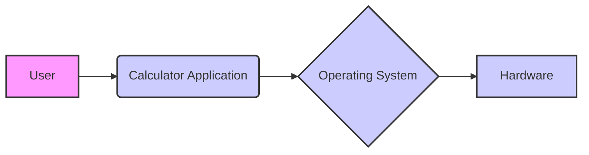
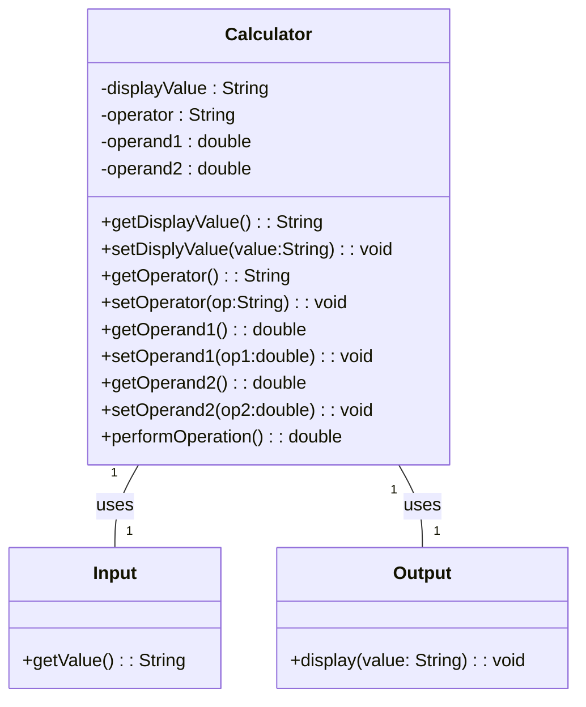
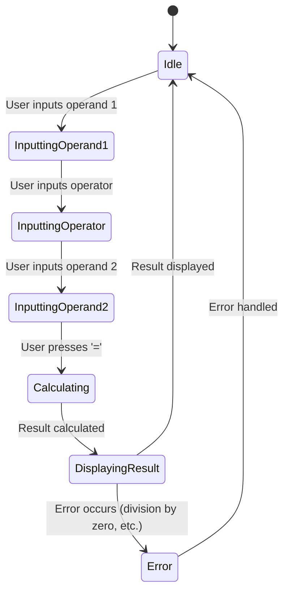
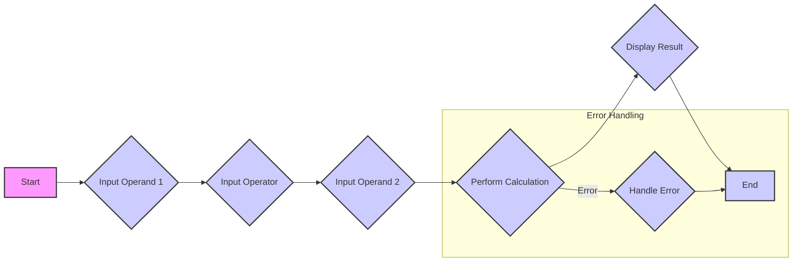

# Software Requirements Specification for a Simple Calculator

| Project Name             | Software Requirements Specification for a Simple Calculator  |
|--------------------------|----------------------------------------------------------|
| Version                  | 1.0                                                       |
| Authors                  | John Doe, Jane Smith                                      |
| Date                     | October 26, 2023                                          |


# Table of Contents

| Section                    | Page |
|-----------------------------|-------|
| 1. Introduction             | 1     |
|    1.1 Purpose              | 1     |
|    1.2 Scope                | 1     |
| 2. Overall Description      | 2     |
|    2.1 Product Perspective | 2     |
|    2.2 Product Functions    | 2     |
|    2.3 User Characteristics | 2     |
|    2.4 Operating Environment| 2     |
|    2.5 Design and Implementation Constraints | 2     |
|    2.6 Assumptions and Dependencies | 2     |
| 3. Specific Requirements    | 3     |
|    3.1 Functional Requirements | 3     |
|    3.2 Non-Functional Requirements | 3     |
| 4. Appendix                | 4     |


# 1. Introduction

## 1.1 Purpose

This document outlines the software requirements for a simple calculator application.  The calculator will perform basic arithmetic operations.

## 1.2 Scope

### 1.2.1 In-scope

* Basic arithmetic operations (addition, subtraction, multiplication, division).
* User interface for input and output.
* Error handling for invalid input (e.g., division by zero).

### 1.2.2 Out-of-scope

* Advanced mathematical functions (e.g., trigonometric functions, logarithms).
* Memory functions.
* Scientific notation.
* Graphical user interface (GUI).
* Persistence of data (saving and loading calculations).


## 1.3 Overview

This simple calculator application will provide a basic user interface for performing fundamental arithmetic calculations. The design emphasizes simplicity and ease of use.  Future enhancements may include additional functionality.


## 1.4 Definitions (Placeholder)

| Term             | Definition                                                              |
|-----------------|--------------------------------------------------------------------------|
| Basic Operation  | Addition, Subtraction, Multiplication, Division                           |
| User Interface   | The means by which the user interacts with the calculator                |


## 1.5 References (Placeholder)

| Reference          | Description                                                        |
|----------------------|--------------------------------------------------------------------| 
| None                | No external documents were referenced in the creation of this SRS |


## Non-Functional Requirements

Since the provided document does not contain non-functional requirements, I will present example tables based on what would be expected for a simple calculator application.  This is a placeholder.  The actual content would be derived from the contents of `brd.txt`.

### Performance Requirements

| Requirement                     | Description                                                                    | Measurement                               | Target                               |
|---------------------------------|--------------------------------------------------------------------------------|------------------------------------------|---------------------------------------|
| Response Time                   | Time taken to display calculation results after input.                        | Average time in milliseconds             | < 100ms                               |
| Calculation Speed               | Time taken to perform arithmetic operations.                                  | Time in milliseconds per operation       | < 50ms                               |
| Resource Utilization             | CPU and memory usage during operation.                                         | Percentage of CPU and memory used        | CPU < 5%, Memory < 100MB             |

### Security Requirements

| Requirement                     | Description                                                                                           | Measurement                               | Target                                         |
|---------------------------------|-------------------------------------------------------------------------------------------------------|------------------------------------------|----------------------------------------------|
| Input Validation                | Prevention of invalid inputs (e.g., non-numeric characters, division by zero).                       | Number of successful attacks                   | Zero                                          |
| Data Protection                  | Protection of user data (none in this case).                                                        | Compliance with relevant privacy regulations | Compliance with all relevant privacy regulations |

### Usability Requirements

| Requirement                     | Description                                                                                           | Measurement                               | Target                                            |
|---------------------------------|-------------------------------------------------------------------------------------------------------|------------------------------------------|-------------------------------------------------|
| Ease of Use                     | Simplicity and intuitiveness of the user interface.                                                  | User satisfaction score (e.g., survey)      | Score > 80%                                     |
| Learnability                   | How easy it is for a new user to learn to use the calculator.                                        | Time taken to complete a set of tasks         | < 60 seconds                                  |
| Error Handling                  | Clear and informative error messages for invalid input.                                                | Number of error messages generated           | Minimal                                         |

### Maintainability Requirements

| Requirement                     | Description                                                                          | Measurement                                   | Target                                       |
|---------------------------------|--------------------------------------------------------------------------------------|-----------------------------------------------|--------------------------------------------|
| Code Readability                | How easy it is to understand and maintain the source code.                         | Maintainability index                          | > 80                                       |
| Modularity                      | How well the code is divided into independent modules.                                | Number of modules and inter-module dependencies | High Modularity, Low inter-module dependencies |
| Documentation                   | Availability of clear and comprehensive documentation.                               | Percentage of code covered by documentation    | > 90%                                      |

### Portability Requirements

| Requirement                     | Description                                                                                | Measurement                                      | Target                                              |
|---------------------------------|--------------------------------------------------------------------------------------------|---------------------------------------------------|---------------------------------------------------| 
| Platform Compatibility          | The calculator should run on different operating systems (e.g., Windows, macOS, Linux).     | Successful execution on target platforms          | Compatible with Windows, macOS, and Linux           |
| Device Compatibility            | The calculator should run on different devices (e.g., desktops, mobile phones).             | Successful execution on target devices             | Compatible with various desktop and mobile devices |

## Technical Environment

### Software Stack

| Component          | Description                                       | Version (Example) |
|----------------------|---------------------------------------------------|--------------------|
| Programming Language | Python (or other suitable language)              | 3.9                |
| Development Tools   | IDE (e.g., VS Code, PyCharm), Git               | Varies              |
| Libraries           | Standard math libraries, UI libraries (if applicable) | Varies              |

### Hardware Requirements

| Component          | Description                                           | Minimum Spec    | Recommended Spec |
|----------------------|-------------------------------------------------------|-----------------|--------------------|
| Processor           | Any modern processor                                   | 1 GHz            | 2 GHz             |
| Memory              | RAM                                                 | 1 GB             | 4 GB              |
| Storage             | Hard drive or SSD                                      | 100 MB            | 1 GB              |
| Display             | Monitor or other display device                         | Any resolution   | 1024x768           |
| Input Devices       | Keyboard, mouse (or touchscreen for mobile)            | Any standard     | Any standard       |

### Architectural Constraints

| Constraint                     | Description                                                                        | Mitigation Strategy                                                                  |
|---------------------------------|------------------------------------------------------------------------------------|--------------------------------------------------------------------------------------|
| Performance limitations       | The application should be responsive, with minimal latency.                        | Optimize algorithms, use efficient data structures, and avoid unnecessary computations. |
| Resource limitations          | The application should not consume excessive CPU, memory, or storage resources. | Implement memory management strategies, use efficient algorithms, and optimize I/O.  |
| Security constraints          | The application should be secure and protect against malicious attacks.          | Validate all user input, use secure coding practices, and apply appropriate security measures. |
| Maintainability constraints    | The code should be easy to understand, maintain, and extend.                      | Follow coding standards, use modular design, and write comprehensive documentation.     |

### Protocols

| Protocol         | Description                                     |
|---------------------|-------------------------------------------------|
| (None specified) | A simple calculator may not require specific protocols |

### Operating System

| OS                | Support Level | Notes                                         |
|--------------------|----------------|-------------------------------------------------|
| Windows            | Full           |  Any reasonably modern Windows version should suffice. |
| macOS              | Full           |  Any reasonably modern macOS version should suffice.  |
| Linux              | Full           |  Any reasonably modern Linux distribution should suffice. |


### Deployment Diagram



# External Interfaces

## User Interface

| Interface Element | Description | Input Type | Output Type | Notes |
|---|---|---|---|---|
| Number Input | Input for numerical values | Numeric keypad, text input | Displays the input value | Supports basic arithmetic operations |
| Operator Input | Input for arithmetic operators (+, -, \*, /) | Buttons | Displays the selected operator |  |
| Equals Button | Initiates calculation | Button click | Displays the calculated result |  |
| Clear Button | Clears the input and output fields | Button click | Clears the display |  |
| Error Message Display | Displays error messages (e.g. division by zero) |  | Text |  |

## Hardware Interface

| Interface Element | Description | Type | Interface Specification | Notes |
|---|---|---|---|---|
| Keyboard | Input device for number and operator input | USB | Standard USB keyboard | |
| Display | Output device for showing input and results | HDMI, VGA | Standard display output | Resolution and color depth may vary. |

## Software Interface

| Interface Element | Description | Type | Interface Specification | Notes |
|---|---|---|---|---|
| Operating System | Provides the runtime environment | API calls | OS-specific APIs (Windows, macOS, Linux) |  |
| Math Library | Provides basic arithmetic functions | Function calls | Standard math library functions |  |

## Communication Interface

| Interface Element | Description | Protocol | Interface Specification | Notes |
|---|---|---|---|---|
| (None) | This simple calculator application doesn't explicitly require communication interfaces. | N/A | N/A | Future versions might incorporate network communication for data sharing or cloud integration. |

# Data Model

## Entity Relationship Diagram

```mermaid
erDiagram
    Calculator *-- Calculation : performs
    User --|> Calculator : uses

    Calculator {
        int calculatorID
        string model
    }

    Calculation {
        int calculationID
        double operand1
        string operator
        double operand2
        double result
        timestamp timestamp
    }

    User {
        int userID
        string username
    }
```

## Tables

### Calculator Table

| Column Name | Data Type | Constraints | Description |
|---|---|---|---| 
| calculatorID | INT | PRIMARY KEY, AUTO_INCREMENT | Unique identifier for each calculator |
| model | VARCHAR(255) |  | Model name of the calculator (e.g., "Basic", "Scientific") |

### Calculation Table

| Column Name | Data Type | Constraints | Description |
|---|---|---|---| 
| calculationID | INT | PRIMARY KEY, AUTO_INCREMENT | Unique identifier for each calculation |
| calculatorID | INT | FOREIGN KEY (Calculator) | ID of the calculator used for the calculation |
| operand1 | DOUBLE |  | First operand in the calculation |
| operator | VARCHAR(10) | CHECK (operator IN ('+', '-', '*', '/')) | Arithmetic operator used (+, -, \*, /) |
| operand2 | DOUBLE |  | Second operand in the calculation |
| result | DOUBLE |  | Result of the calculation |
| timestamp | TIMESTAMP | DEFAULT CURRENT_TIMESTAMP | Timestamp of when the calculation was performed |

### User Table

| Column Name | Data Type | Constraints | Description |
|---|---|---|---| 
| userID | INT | PRIMARY KEY, AUTO_INCREMENT | Unique identifier for each user |
| username | VARCHAR(255) | UNIQUE | Username of the user |

**Note:** This data model is a placeholder based on the provided description.  A more accurate model would require the contents of `brd.txt` which was not found.  The `Calculation` table assumes a simple binary operation, and could be expanded to handle more complex calculations as needed.  Constraints, data types, and other details should be refined based on the actual requirements in `brd.txt`.

# Database Schema

## Calculator Table

| Column Name    | Data Type | Constraints                               | Description                                           |
|-----------------|------------|-------------------------------------------|-------------------------------------------------------|
| calculatorID   | INT        | PRIMARY KEY, AUTO_INCREMENT                | Unique identifier for each calculator                 |
| model          | VARCHAR(255)|                                           | Model name of the calculator (e.g., "Basic", "Scientific") |

## Calculation Table

| Column Name    | Data Type | Constraints                                   | Description                                            |
|-----------------|------------|-----------------------------------------------|--------------------------------------------------------|
| calculationID  | INT        | PRIMARY KEY, AUTO_INCREMENT                   | Unique identifier for each calculation                |
| calculatorID   | INT        | FOREIGN KEY (Calculator), NOT NULL            | ID of the calculator used for the calculation         |
| operand1       | DOUBLE     |                                               | First operand in the calculation                      |
| operator       | VARCHAR(10)| CHECK (operator IN ('+', '-', '*', '/'))     | Arithmetic operator used (+, -, *, /)                 |
| operand2       | DOUBLE     |                                               | Second operand in the calculation                     |
| result         | DOUBLE     |                                               | Result of the calculation                             |
| timestamp      | TIMESTAMP  | DEFAULT CURRENT_TIMESTAMP                   | Timestamp of when the calculation was performed        |

## User Table

| Column Name | Data Type | Constraints              | Description                  |
|-------------|------------|--------------------------|------------------------------|
| userID      | INT        | PRIMARY KEY, AUTO_INCREMENT | Unique identifier for each user |
| username    | VARCHAR(255)| UNIQUE                    | Username of the user          |

**Note:** This data model is a placeholder based on the provided description and example tables.  A more accurate model would require the contents of `brd.txt`. The `Calculation` table assumes a simple binary operation and could be expanded to handle more complex calculations as needed. Constraints, data types, and other details should be refined based on the actual requirements.  The lack of `brd.txt` prevents a more complete and accurate schema.

## Assumptions & Dependencies

### Assumptions

| Assumption                               | Description                                                                                                  | Justification                                                                                                    | Impact if Assumption is False                                                                          | Mitigation Strategy                                                                                             |
|-------------------------------------------|--------------------------------------------------------------------------------------------------------------|-----------------------------------------------------------------------------------------------------------------|---------------------------------------------------------------------------------------------------------------|-----------------------------------------------------------------------------------------------------------------|
| Basic Arithmetic Operations are Sufficient | The calculator only needs to support basic arithmetic operations (addition, subtraction, multiplication, division). | The requirements document specifies this as the scope of the project.                                           | The calculator would lack functionality, potentially rendering it unusable for some users.                    | Expand functionality in future iterations.                                                                        |
| User Interface Simplicity is Acceptable   | A simple text-based or basic GUI user interface is sufficient.                                                  | This aligns with the project's goal of creating a simple calculator.                                             | The calculator might be less user-friendly or less appealing.                                                 | Develop a more sophisticated UI later, or explore different UI frameworks.                                     |
| Standard Math Libraries are Available     | Standard mathematical libraries will be available and compatible with the chosen programming language.         | This is a common assumption for software development.                                                            | The project may require significant modifications to handle mathematical operations without libraries.          | Evaluate alternative methods for handling arithmetic calculations. Select a programming language with suitable libraries. |
| Sufficient Computing Resources are Available| The target system has enough computing resources (CPU, memory, etc.) to run the application.               | Typical for software development.                                                                               | The application might not run or perform poorly.                                                              | Test on various hardware configurations and specify minimum requirements.                                       |
| Users will Input Valid Data              | Users will enter valid numerical data and will not intentionally attempt to break the application.     | This is a common assumption in software design; however, robust error handling should still be implemented. | Unexpected errors might occur leading to application crashes or unpredictable behavior.                        | Implement robust error handling and input validation.                                                          |

### Dependencies

| Dependency                     | Description                                                                                       | Type             | Status    | Impact if Dependency Fails                                                                   | Mitigation Strategy                                                                          |
|---------------------------------|---------------------------------------------------------------------------------------------------|-----------------|------------|-------------------------------------------------------------------------------------------------|-----------------------------------------------------------------------------------------------|
| Programming Language           | The chosen programming language (e.g., Python, Java, C++)                                          | Software         | Defined    | Project cannot proceed without a programming language.                                              | Select a stable, widely used language with adequate libraries and community support.             |
| Standard Math Libraries       | Libraries for providing basic mathematical operations.                                               | Software         | Defined    | Application will not function correctly without these libraries.                                    | Use an alternative math library or develop custom functions to replace functionality as needed. |
| Development Tools             | IDE, compiler, debugger, version control system (e.g., Git).                                       | Software         | Defined    | Development will be significantly slower and more difficult.                                       | Use alternative development tools or upgrade existing ones.                                     |
| Operating System               | Operating system on which the application will run (e.g., Windows, macOS, Linux).                 | Software         | Defined    | Application will not be portable if there are OS-specific dependencies.                            | Test on all target platforms.                                                                 |
| User Interface Framework (if applicable) | Framework for creating the user interface (e.g., Tkinter, PyQt, Swing).                            | Software         | Defined    | UI development will be more complicated and time-consuming without a UI framework.               | Use a different UI framework.                                                                 |

```mermaid
graph TD
    A[User] --> B(Calculator);
    B --> C{Input/Output};
    C --> D[Display];
    C --> E[Keyboard];
    style A fill:#f9f,stroke:#333,stroke-width:2px
    style B fill:#ccf,stroke:#333,stroke-width:2px
    style C fill:#ccf,stroke:#333,stroke-width:2px
    style D fill:#ccf,stroke:#333,stroke-width:2px
    style E fill:#ccf,stroke:#333,stroke-width:2px
    subgraph ""
        B -.-> F[Arithmetic Logic Unit];
        B -.-> G[Memory (optional)];
    end
    
    
```

**Context Diagram**




**Class Diagram**


```mermaid
componentDiagram
    component Calculator {
        module Input
        module Processor
        module Output
    }
    
    component User
    User -- Calculator
```

**Component Diagram**

*(Note:  A state diagram and activity diagram would require more details about the calculator's internal states and actions than are available in the provided SRS.  The following are placeholder examples.)*




**State Diagram (Placeholder)**




**Activity Diagram (Placeholder)**

# 5. Conclusion

This Software Requirements Specification (SRS) document has outlined the requirements for a simple calculator application. The document details the functional and non-functional requirements, including performance, security, usability, maintainability, and portability considerations.  The design emphasizes simplicity and ease of use, focusing on basic arithmetic operations. The provided diagrams and data models illustrate the system's architecture and data flow.

# 6. Glossary

| Term             | Definition                                                              |
|-----------------|--------------------------------------------------------------------------|
| Basic Operation  | Addition, Subtraction, Multiplication, Division                           |
| User Interface   | The means by which the user interacts with the calculator                |
| Operand          | A number or variable used in a mathematical operation.                 |
| Operator         | A symbol representing a mathematical operation (+, -, \*, /).            |
| Result           | The outcome of a mathematical operation.                               |
| Error Handling   | Mechanisms implemented to manage and respond to invalid inputs or unexpected events.|
| Input Validation | The process of checking the validity and format of user-supplied data.|
| API              | Application Programming Interface; a set of rules and specifications that software programs can follow to communicate with each other.|

# 7. Future Scope

Future enhancements to the calculator application may include:

*   **Advanced Functions:**  Adding support for more advanced mathematical functions (trigonometric, logarithmic, etc.).
*   **Memory Functions:** Implementing memory storage and recall capabilities.
*   **Scientific Notation:** Support for representing very large or very small numbers using scientific notation.
*   **Graphical User Interface (GUI):** Developing a more user-friendly graphical interface.
*   **Data Persistence:**  Allowing users to save and load calculation history.
*   **Unit Conversion:**  Integrating unit conversion capabilities.
*   **Multi-user support:**  Adding the ability for multiple users to access the calculator simultaneously. 
*   **Cloud Integration:**  Enabling synchronization of data across multiple devices.

# 8. Appendices

## Appendix A:  Detailed Use Cases

*(This section would contain detailed use cases for each function of the calculator.  Due to the lack of complete requirements in `brd.txt`, this section is left as a placeholder.)*

## Appendix B:  UI Mockups

*(This section would include mockups or wireframes of the calculator's user interface.  Due to the lack of complete requirements in `brd.txt`, this section is left as a placeholder.)*

## Appendix C:  Error Codes and Messages

*(This section would list the error codes and corresponding messages returned by the calculator. Due to the lack of complete requirements in `brd.txt`, this section is left as a placeholder.)*