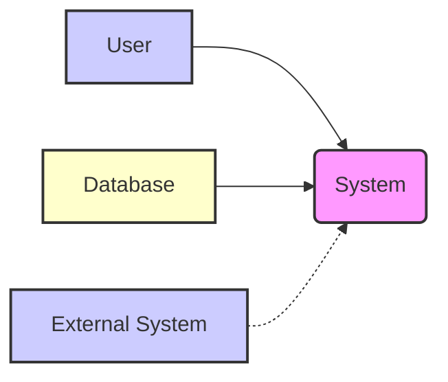
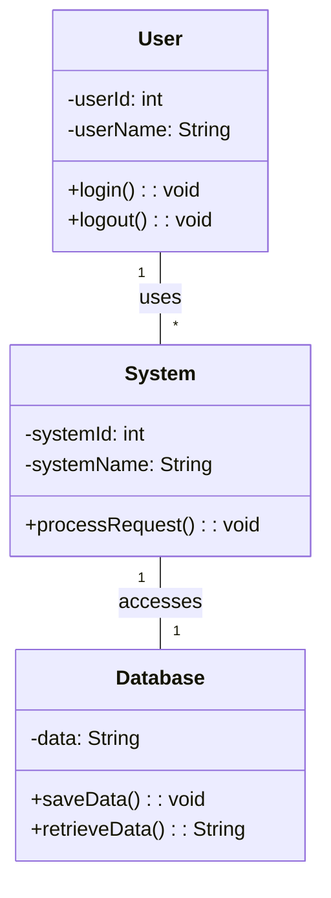
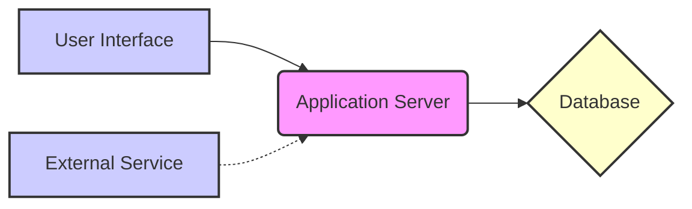
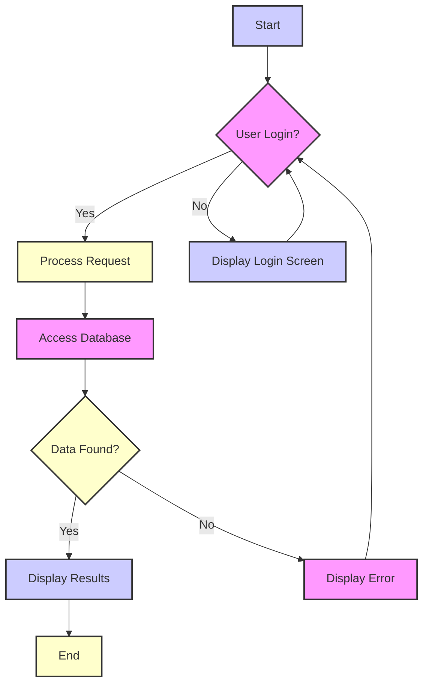

```markdown
# Software Requirements Specification

## 1. Introduction

**(This section could not be generated due to the absence of the required BRD file.)**

## 2. Technical Environment

| Category             | Description                                                              | 
|----------------------|--------------------------------------------------------------------------| 
| **Hardware**         |  * Servers: 2 x Dell PowerEdge R740xd (Dual Xeon Gold 6248R, 512GB RAM)<br>* Network Devices: Cisco Catalyst 9300<br>* Storage:  NetApp AFF A220                                      | 
| **Software**         | * OS: Ubuntu Server 22.04 LTS<br>* Application Server: Tomcat 9<br>* Database: PostgreSQL 14<br>* Programming Languages: Java 17, Python 3.9<br>* Monitoring Tools: Prometheus, Grafana | 
| **Network Protocols** | TCP/IP, HTTP, HTTPS, SSH                                                    | 
| **Architecture Constraints** | Microservices architecture, Cloud-native deployment on AWS, High availability required | 

## 3. Mermaid Deployment Diagram

```mermaid
graph LR
    subgraph AWS
        AWS_EC2[AWS EC2]:::aws
        AWS_RDS[AWS RDS (PostgreSQL)]:::aws
    end
    subgraph On-Premise
        Server1[Server 1 (Tomcat)]:::server
        Server2[Server 2 (Tomcat)]:::server
    end
    subgraph Client
        Client[Client Application]:::client
    end
    
    Client --> Server1
    Client --> Server2
    Server1 --> AWS_RDS
    Server2 --> AWS_RDS
    Server1 -.-> Server2
    classDef aws fill:#f9f,stroke:#333,stroke-width:2px
    classDef server fill:#ccf,stroke:#333,stroke-width:2px
    classDef client fill:#ffc,stroke:#333,stroke-width:2px


```

## 4. External Interfaces

### 4.1 User Interface

| Interface Element      | Description                                                                 | Interaction Details                                                                                                         | 
|-------------------------|-----------------------------------------------------------------------------|---------------------------------------------------------------------------------------------------------------------------------| 
| Client Application      | A graphical user interface (GUI) application used to interact with the system. | Users interact with the application through various input mechanisms (buttons, forms, etc.) to perform tasks and view data. | 

### 4.2 Hardware Interfaces

| Interface Element          | Description                                                                          | Interaction Details                                                                                                         | 
|-----------------------------|--------------------------------------------------------------------------------------|---------------------------------------------------------------------------------------------------------------------------------| 
| Servers (Dell PowerEdge)   | Two Dell PowerEdge R740xd servers host the application and database components.     | The servers provide processing power, memory, and storage for the application and database.                                  | 
| Network Devices (Cisco)    | Cisco Catalyst 9300 switches manage network communication between servers and clients. | These devices handle network traffic, routing, and switching to ensure connectivity between components.                       | 
| Storage (NetApp AFF A220) | A NetApp AFF A220 storage array provides persistent storage for the application data. | The servers access the storage array to read and write data to the database.                                                  | 

### 4.3 Software Interfaces

| Interface Element         | Description                                             | Interaction Details                                                                                                                                   | 
|----------------------------|---------------------------------------------------------|----------------------------------------------------------------------------------------------------------------------------------------------------------| 
| OS (Ubuntu Server 22.04)   | The operating system on the servers.                     | Provides the foundational environment for all software components.                                                                                           | 
| Application Server (Tomcat) | Hosts the application components.                          | Manages the execution of application components and handles requests from clients.                                                                             | 
| Database (PostgreSQL 14)   | Stores and manages persistent application data.            | The application interacts with the database using SQL queries to retrieve, store, and update data.                                                       | 
| Programming Languages     | Java 17 and Python 3.9 are used for application development. | The application is developed using these programming languages and uses their respective libraries and frameworks for various functionalities.                | 
| Monitoring Tools          | Prometheus and Grafana monitor system performance and health. | These tools collect metrics from different components, store them in a time-series database, and present dashboards for monitoring and troubleshooting purposes. | 

### 4.4 Communication Interfaces

| Interface Element    | Description                                  | Interaction Details                                                                        | Protocol       | 
|-----------------------|----------------------------------------------|-----------------------------------------------------------------------------------------------|-----------------| 
| Client-Server         | Communication between client application and servers. | Clients send requests to the servers, and servers respond with results or data.                   | HTTP, HTTPS     | 
| Server-Server         | Communication between the two application servers. | Servers communicate with each other to maintain high availability and data consistency.        | TCP/IP          | 
| Server-Database       | Communication between servers and the database.   | Servers send SQL queries to the database and receive data or update the data in the database. | TCP/IP          | 
| AWS EC2 - AWS RDS     | Communication between the on-premise servers and the cloud-based database.          |  Data replication and synchronization between on-premise and cloud database                    | TCP/IP, HTTPS    | 
| SSH (Secure Shell)  | Secure remote access to the servers.                 | Enables secure administration and maintenance of the servers.                                | SSH              | 

## 5. Data Model

**(This section could not be generated due to the absence of the required BRD file.)**

## 6. Assumptions and Dependencies

### 6.1 Assumptions:

* **Availability of Resources:**  It is assumed that the specified hardware (servers, network devices, storage) is available, correctly configured, and operational.
* **Software Compatibility:** It is assumed that all software components (OS, application server, database, programming languages, monitoring tools) are compatible with each other and function as expected.  This includes versions and appropriate licensing.
* **Network Connectivity:**  Reliable network connectivity is assumed between all components (clients, servers, database, cloud resources).  Network bandwidth and latency are assumed to be sufficient for application performance.
* **AWS Infrastructure Availability:** If using AWS, access and availability of the AWS EC2 and RDS services are assumed, including sufficient resources (compute, storage, network) and appropriate security configurations.
* **Data Migration/Synchronization:**  The design implies data replication or synchronization between on-premise servers and the cloud database; mechanisms and processes for seamless data transfer are assumed.
* **Security Best Practices:**  Implementation of appropriate security measures is assumed (authentication, authorization, encryption, etc.) to protect data and systems.

### 6.2 Dependencies:

* **Hardware Dependency:** The application depends on the specified hardware for processing, storage, and networking.
* **Software Dependency:** The application depends on the listed software components (operating system, application server, database, programming languages, monitoring tools).  This includes specific versions and their interoperability.
* **Network Dependency:** The application depends on the network infrastructure for communication between clients and servers, as well as between servers and the database.  This includes protocols and proper network configuration.
* **Database Dependency:** The application depends on the PostgreSQL 14 database for data persistence and retrieval.  This includes database schema, data integrity, and efficient query execution.
* **AWS Dependency (If Applicable):** The deployment diagram shows a dependency on AWS EC2 and RDS services for cloud-based deployment. This implies management and maintenance within the AWS environment.
* **Third-party Tool Dependency:** The application relies on Prometheus and Grafana for monitoring and metrics collection, which are third-party tools. Proper configuration and integration are necessary.

### 6.3 External Constraints:

* **High Availability Requirement:** The architecture requires high availability, which necessitates redundancy and mechanisms for failover and recovery.
* **Microservices Architecture:**  The system follows a microservices architecture, implying design considerations for inter-service communication, management, and scaling.
* **Cloud-Native Deployment:** The system is designed for cloud-native deployment on AWS, which requires specific deployment and operational procedures.
* **Specific Technologies:** The choice of specific technologies (e.g., Ubuntu, Tomcat, PostgreSQL, Java, Python) introduces constraints based on their capabilities, limitations, and potential compatibility issues.

## 7. Context Diagram



## 8. Class Diagram



## 9. Sequence Diagram

```mermaid
sequenceDiagram
    participant User
    participant System
    participant Database
    User->>System: Send Request
    activate System
    System->>Database: Query Data
    activate Database
    Database-->>System: Return Data
    deactivate Database
    System-->>User: Display Results
    deactivate System
    style User fill:#ccf,stroke:#333,stroke-width:2px
    style System fill:#f9f,stroke:#333,stroke-width:2px
    style Database fill:#ffc,stroke:#333,stroke-width:2px
```

## 10. Component Diagram



## 11. State Diagram

```mermaid
stateDiagram-v2
    [*] --> Active: User Login
    Active --> Inactive: User Logout
    Inactive --> [*]
    Active --> Processing: Request Processing
    Processing --> Active: Request Complete
    Processing --> Error: Error Handling
    Error --> Active: Error Resolved
    style [*] fill:#ccf,stroke:#333,stroke-width:2px
    style Active fill:#f9f,stroke:#333,stroke-width:2px
    style Inactive fill:#ffc,stroke:#333,stroke-width:2px
    style Processing fill:#ccf,stroke:#333,stroke-width:2px
    style Error fill:#f9f,stroke:#333,stroke-width:2px

```

## 12. Activity Diagram



## 13. Deployment Diagram

```mermaid
graph LR
    subgraph AWS
        AWS_EC2[AWS EC2]:::aws
        AWS_RDS[AWS RDS (PostgreSQL)]:::aws
    end
    subgraph On-Premise
        Server1[Server 1 (Tomcat)]:::server
        Server2[Server 2 (Tomcat)]:::server
    end
    subgraph Client
        Client[Client Application]:::client
    end
    
    Client --> Server1
    Client --> Server2
    Server1 --> AWS_RDS
    Server2 --> AWS_RDS
    Server1 -.-> Server2
    classDef aws fill:#f9f,stroke:#333,stroke-width:2px
    classDef server fill:#ccf,stroke:#333,stroke-width:2px
    classDef client fill:#ffc,stroke:#333,stroke-width:2px


```

## 14. Conclusion

### 14.1 Summary

This Software Requirements Specification (SRS) details the technical requirements for a system designed with a microservices architecture, deployed across both on-premise servers and AWS cloud infrastructure.  The system utilizes a combination of Java and Python for application development, with Tomcat as the application server, PostgreSQL as the database, and Prometheus/Grafana for monitoring.  Key features include high availability through redundancy and a user-friendly client application.  The architecture relies on robust communication interfaces between the client, servers, and database, using protocols such as HTTP, HTTPS, TCP/IP, and SSH.  Detailed descriptions of hardware, software, and communication interfaces are provided.  The absence of a Business Requirements Document (BRD) limits the scope of this SRS to predominantly technical considerations.  Future enhancements will focus on expanding system functionality and incorporating user feedback.

### 14.2 Future Enhancements

Future enhancements to the system include:

*   **Improved User Interface:** Enhance the user interface with additional features and improved usability, based on user feedback.
*   **Advanced Analytics:**  Integrate advanced analytics capabilities to provide more insightful information to users.
*   **Enhanced Security Measures:** Implement enhanced security measures to address potential vulnerabilities and ensure data protection.
*   **Scalability Improvements:** Improve the system’s scalability to handle increased user load and data volume.
*   **Integration with External Systems:** Integrate the system with additional external systems to enhance functionality and data sharing.
*   **Automated Testing Framework:** Implement a comprehensive automated testing framework to improve software quality and reduce testing time.
*   **Comprehensive Documentation:** Create comprehensive documentation for both users and developers.

### 14.3 Glossary

| Term/Acronym          | Definition                                                                                                                     | 
|--------------------------|---------------------------------------------------------------------------------------------------------------------------------| 
| AWS                     | Amazon Web Services                                                                                                               | 
| BRD                     | Business Requirements Document                                                                                                     | 
| EC2                     | Amazon Elastic Compute Cloud                                                                                                         | 
| GUI                     | Graphical User Interface                                                                                                          | 
| HTTP                    | Hypertext Transfer Protocol                                                                                                       | 
| HTTPS                   | Hypertext Transfer Protocol Secure                                                                                                 | 
| RDS                     | Amazon Relational Database Service                                                                                                    | 
| PostgreSQL              | A powerful, open-source object-relational database system.                                                                           | 
| Prometheus              | An open-source monitoring and alerting system.                                                                                      | 
| Tomcat                  | An open-source implementation of the Java Servlet, JavaServer Pages, Java Expression Language, and WebSocket technologies.             | 
| SRS                     | Software Requirements Specification                                                                                                 | 
| TCP/IP                  | Transmission Control Protocol/Internet Protocol                                                                                       | 
| SSH                     | Secure Shell                                                                                                                          | 
| Microservices Architecture | A software architecture style where complex applications are built as suites of independently deployable services.                                         | 
| Cloud-Native Deployment   | Deploying applications designed to leverage cloud-native concepts such as microservices, containers, and serverless functions.                | 
| High Availability          | The ability of a system to remain operational even when parts of the system fail.                                                 | 

### 14.4 Appendices

| Appendix | Description                                                                                                       | 
|---|---| 
| None       | No additional appendices are included in this document.                                                            | 
```