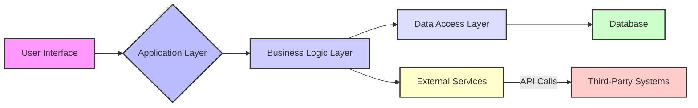
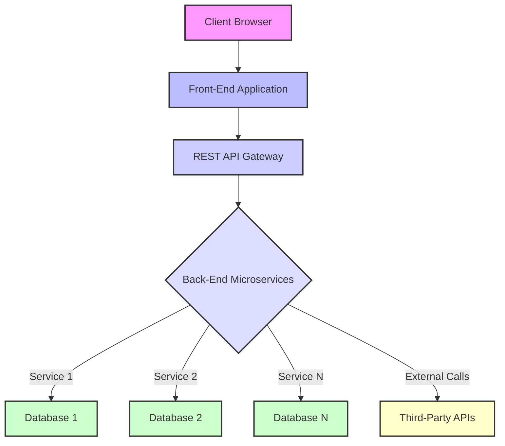
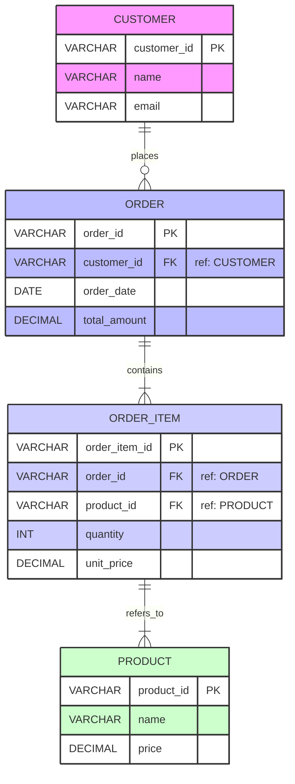

# Software Design Document (SDD)

111111

## 1. Introduction

### 1.1 Purpose

This Software Design Document (SDD) details the technical design of the [System Name - Placeholder] system. It describes the system's architecture, data model, API specifications, user interface design considerations, security measures, and deployment strategy. This document serves as a blueprint for the development team, guiding the implementation process and ensuring alignment with the intended system behavior and quality attributes.

### 1.2 Scope

The scope of this document covers the design of the [System Name - Placeholder] system, focusing on its core functionalities as outlined in the (missing) Software Requirements Specification (SRS) document. This includes the design of the database schema, external and internal API interfaces, key user interface elements, and the underlying technical architecture.
Excluded from this scope are detailed project management plans, testing procedures (beyond validation rules), and operational runbooks, which will be covered in separate documentation. Specific functional requirements referenced herein are placeholders due to the unavailability of the SRS.

### 1.3 Definitions, Acronyms, and Abbreviations

- **API:** Application Programming Interface
- **DB:** Database
- **ER Diagram:** Entity-Relationship Diagram
- **FE:** Front-End
- **BE:** Back-End
- **NFR:** Non-Functional Requirement
- **RBAC:** Role-Based Access Control
- **SDD:** Software Design Document
- **SRS:** Software Requirements Specification
- **TLS/SSL:** Transport Layer Security / Secure Sockets Layer
- **UI:** User Interface

### 1.4 References

- (Missing) Software Requirements Specification (SRS) Document - `srs.txt`
- [Any relevant standards, e.g., OpenAPI Specification]
- [Any external system documentation]

### 1.5 Overview

The subsequent sections of this SDD provide a detailed breakdown of the [System Name - Placeholder] system's design. Section 2 describes the high-level system architecture, technology choices, and deployment strategy. Section 3 outlines the data management strategy, including the database design. Section 4 specifies the API design. Section 5 covers user interface design aspects, including wireframes and validation rules. Section 6 details the security and compliance considerations. Section 7 provides appendices with supplementary information.

### 1.6 Assumptions

- Assume a modern web browser will be used by users for the front-end interface.
- Assume standard networking infrastructure is available (TCP/IP, DNS, HTTP/S).
- Assume necessary third-party services (e.g., payment gateway, email service) are available and accessible via their documented APIs.
- Assume the underlying operating system and hardware meet the minimum requirements for the chosen technology stack.
- Assume the (missing) SRS provides a complete and stable set of functional requirements.

### 1.7 Constraints

- Must adhere to [Placeholder Compliance Standard, e.g., GDPR] for data handling.
- System must be deployed on [Placeholder Cloud Provider, e.g., AWS].
- Maximum response time for key user interactions must be under [Placeholder time, e.g., 3 seconds].
- System must support up to [Placeholder number, e.g., 1000] concurrent users.
- Development must be completed within [Placeholder timeframe].

### 1.8 Stakeholders

- **Project Manager:** Concerned with schedule, budget, and resource allocation.
- **Development Team:** Responsible for implementing the design.
- **QA Team:** Responsible for testing the system against requirements and design.
- **Operations Team:** Responsible for deploying, monitoring, and maintaining the system.
- **End Users:** Will use the system to perform specific tasks (detailed in the missing SRS).
- **Business Owners:** Define the functional and business requirements for the system.

## 2. System Overview

### 2.1 High-level Architecture

The system will follow a multi-tier architecture, separating the presentation layer (Front-End), business logic layer (Back-End API), and data storage layer (Database). This separation promotes modularity, scalability, and maintainability.

#### 2.1.1 Conceptual Architecture

The conceptual architecture illustrates the primary components and their relationships from a high-level perspective.



_Description:_ Users interact with the system through a User Interface (A). The Application Layer (B) handles incoming requests, forwarding them to the Business Logic Layer (C). The Business Logic Layer (C) contains the core application logic, interacting with the Data Access Layer (D) to persist and retrieve data from the Database (E). It may also interact with External Services (F) to communicate with Third-Party Systems (G).

#### 2.1.2 Logical Architecture

The logical architecture groups components based on their function.



_Description:_ The system is designed as a set of interacting microservices accessible via a REST API Gateway. The Front-End Application runs in the Client Browser and communicates with the Back-End Microservices through the Gateway. Each microservice (or groups of services) may interact with its own dedicated database or a shared database and communicate with external third-party APIs.

#### 2.1.3 Physical Architecture

The physical architecture describes how the logical components are deployed onto physical infrastructure.

```mermaid
graph LR
    User --> CDN[Content Delivery Network]
    CDN --> FE_LB[Front-End Load Balancer]
    FE_LB --> FE_Servers[Front-End Servers \n (e.g., Kubernetes Pods)]
    FE_Servers --> API_GW_LB[API Gateway Load Balancer]
    API_GW_LB --> API_Gateway[API Gateway \n (e.g., Nginx, Kong)]
    API_Gateway --> BE_LB[Back-End Load Balancer]
    BE_LB --> BE_Servers[Back-End Microservices \n (e.g., Kubernetes Pods)]
    BE_Servers --> DB_Cluster[Database Cluster \n (e.g., RDS, MongoDB Atlas)]
    BE_Servers --> Ext_Svcs[External Services]

    style User fill:#f9f,stroke:#333,stroke-width:2px
    style CDN fill:#bbf,stroke:#333,stroke-width:2px
    style FE_LB fill:#ccf,stroke:#333,stroke-width:2px
    style FE_Servers fill:#ddf,stroke:#333,stroke-width:2px
    style API_GW_LB fill:#eef,stroke:#333,stroke-width:2px
    style API_Gateway fill:#eed,stroke:#333,stroke-width:2px
    style BE_LB fill:#dcf,stroke:#333,stroke-width:2px
    style BE_Servers fill:#cbf,stroke:#333,stroke-width:2px
    style DB_Cluster fill:#cfc,stroke:#333,stroke-width:2px
    style Ext_Svcs fill:#ffc,stroke:#333,stroke-width:2px
```

_Description:_ Static front-end assets are served via a Content Delivery Network (CDN). Dynamic front-end requests are routed through a Load Balancer to Front-End Servers running in containers (e.g., orchestrated by Kubernetes). These servers communicate with the Back-End via an API Gateway, also potentially load-balanced. Back-End Microservices run in containers, managed by a separate Load Balancer. Data is stored in a highly available Database Cluster. Microservices communicate with external services as needed.

### 2.2 Technology Stack

- **Front-End:** [Placeholder Framework, e.g., React, Angular, Vue.js], HTML5, CSS3, JavaScript/TypeScript
- **Back-End:** [Placeholder Language/Framework, e.g., Node.js/Express, Python/Django/Flask, Java/Spring Boot, .NET Core], Microservice Architecture
- **Database:** [Placeholder Database Type, e.g., PostgreSQL, MongoDB, MySQL]
- **API Gateway:** [Placeholder, e.g., Nginx, Kong, AWS API Gateway]
- **Containerization:** Docker
- **Orchestration:** Kubernetes
- **Cloud Platform:** [Placeholder, e.g., AWS, Azure, GCP]
- **Other Tools:** [e.g., CI/CD pipelines (Jenkins, GitLab CI), Monitoring (Prometheus, Grafana), Logging (ELK stack)]

_Justification:_ (Placeholder - justification would be based on project requirements, team expertise, scalability needs, cost, etc. Specific justification cannot be provided without SRS context).

### 2.3 Deployment Architecture

The system will be deployed on [Placeholder Cloud Provider, e.g., AWS] using a containerized approach orchestrated by Kubernetes.

- **Environments:** Development, Staging, Production. Each environment will have dedicated resources.
- **Containerization:** All application services (Front-End servers, Back-End Microservices, API Gateway) will be containerized using Docker.
- **Orchestration:** Kubernetes will manage the deployment, scaling, and management of the containers. Deployments will utilize rolling updates.
- **Scaling:** Horizontal Pod Autoscalers in Kubernetes will scale microservices automatically based on CPU usage or custom metrics. The database cluster will be configured for replication and potential read replicas for scaling read operations.
- **Load Balancing:** Cloud provider load balancers will distribute traffic across Kubernetes nodes and within the cluster to different service pods.
- **Infrastructure:** Utilizing managed services from the cloud provider where appropriate (e.g., Managed Kubernetes, Managed Database Service, Load Balancers).

### 2.4 Performance & Scalability

- **Performance:**
  - Utilize efficient algorithms and data structures in the business logic.
  - Optimize database queries and use appropriate indexing.
  - Implement caching mechanisms (e.g., Redis) for frequently accessed data.
  - Serve static assets via a CDN.
  - Compress and optimize assets (images, CSS, JS) for faster loading.
  - Implement asynchronous processing for non-critical tasks (e.g., email notifications) using message queues (e.g., RabbitMQ, Kafka, SQS).
- **Scalability:**
  - Architected as microservices to allow independent scaling of components.
  - Leverage Kubernetes Horizontal Pod Autoscalers for application tier scaling.
  - Utilize a scalable database solution capable of handling increased load (e.g., sharding, replication).
  - Employ load balancing at multiple layers to distribute traffic effectively.
  - Design for statelessness in microservices where possible to facilitate easy horizontal scaling.

## 3. Data Management Strategy

### 3.1 ER Schema with Example Database Models

_This section is heavily dependent on the "Data Model" or equivalent section of the missing SRS document. The specific entities, attributes, and relationships defined in the requirements are needed to generate an accurate ER schema and example models. Placeholder content is provided below._

**Conceptual ER Diagram (Placeholder)**



_Description:_ (Placeholder) The diagram shows a basic e-commerce model with Customers placing Orders, which contain multiple Order Items, each referring to a Product.

**Example Database Models (Placeholder - based on the generic ER diagram above)**

```sql
-- Example for PostgreSQL

-- Table: customers
CREATE TABLE customers (
    customer_id VARCHAR(255) PRIMARY KEY,
    name VARCHAR(255) NOT NULL,
    email VARCHAR(255) UNIQUE NOT NULL,
    created_at TIMESTAMP WITH TIME ZONE DEFAULT CURRENT_TIMESTAMP
);

-- Example Data
-- INSERT INTO customers (customer_id, name, email) VALUES
-- ('cust_001', 'Alice Smith', 'alice.smith@example.com'),
-- ('cust_002', 'Bob Johnson', 'bob.j@example.com');


-- Table: products
CREATE TABLE products (
    product_id VARCHAR(255) PRIMARY KEY,
    name VARCHAR(255) NOT NULL,
    description TEXT,
    price DECIMAL(10, 2) NOT NULL CHECK (price >= 0),
    stock_quantity INT NOT NULL CHECK (stock_quantity >= 0),
    created_at TIMESTAMP WITH TIME ZONE DEFAULT CURRENT_TIMESTAMP
);

-- Example Data
-- INSERT INTO products (product_id, name, description, price, stock_quantity) VALUES
-- ('prod_a1b2', 'Laptop Pro', 'Powerful laptop with 16GB RAM', 1200.00, 50),
-- ('prod_c3d4', 'Wireless Mouse', 'Ergonomic wireless mouse', 25.50, 200);


-- Table: orders
CREATE TABLE orders (
    order_id VARCHAR(255) PRIMARY KEY,
    customer_id VARCHAR(255) REFERENCES customers(customer_id) ON DELETE CASCADE,
    order_date TIMESTAMP WITH TIME ZONE DEFAULT CURRENT_TIMESTAMP,
    total_amount DECIMAL(10, 2) NOT NULL CHECK (total_amount >= 0),
    status VARCHAR(50) DEFAULT 'Pending' CHECK (status IN ('Pending', 'Processing', 'Shipped', 'Delivered', 'Cancelled')),
    shipping_address TEXT
);

-- Example Data
-- INSERT INTO orders (order_id, customer_id, total_amount, status, shipping_address) VALUES
-- ('order_xyz789', 'cust_001', 1225.50, 'Processing', '123 Main St, Anytown');


-- Table: order_items
CREATE TABLE order_items (
    order_item_id VARCHAR(255) PRIMARY KEY,
    order_id VARCHAR(255) REFERENCES orders(order_id) ON DELETE CASCADE,
    product_id VARCHAR(255) REFERENCES products(product_id) ON DELETE RESTRICT, -- Prevent deleting product if items exist
    quantity INT NOT NULL CHECK (quantity > 0),
    unit_price DECIMAL(10, 2) NOT NULL CHECK (unit_price >= 0)
);

-- Example Data
-- INSERT INTO order_items (order_item_id, order_id, product_id, quantity, unit_price) VALUES
-- ('item_1a2b', 'order_xyz789', 'prod_a1b2', 1, 1200.00),
-- ('item_3c4d', 'order_xyz789', 'prod_c3d4', 1, 25.50);

```

_Note: The specific schema and examples would be derived directly from the detailed data model requirements in the SRS._

### 3.2 Data Lifecycle Management

- **Data Creation:** Data is primarily created through user interactions via the front-end, submitted via APIs, or imported from integrated systems.
- **Data Usage:** Data is accessed by the application logic to fulfill user requests and perform background processing.
- **Data Retention:** Define retention policies based on compliance requirements and business needs. For example, customer order history might be retained for 7 years for tax purposes. Data subject to [Placeholder Compliance Standard] will follow its specific retention rules.
- **Archival:** Seldom-accessed historical data (e.g., orders older than 5 years but less than 7) may be moved to a lower-cost archival storage tier.
- **Purging:** Data that has exceeded its retention period and is not subject to legal hold will be securely deleted from active and archival storage. A process will be established for periodic review and purging.

### 3.3 Backup and Recovery Strategy

- **Backup Frequency:** Full database backups will be performed daily. Incremental backups will be performed every hour. Transaction logs will be backed up every [Placeholder frequency, e.g., 5 minutes].
- **Storage Location:** Backups will be stored securely in a separate availability zone or region from the primary database, using encrypted storage.
- **Retention Period:** Daily backups will be retained for [Placeholder, e.g., 30 days]. Hourly backups for [Placeholder, e.g., 7 days]. Transaction logs for [Placeholder, e.g., 2 days].
- **Recovery Procedures:** Documented procedures for point-in-time recovery to restore the database to a specific timestamp in case of data corruption or loss. Regular testing of restore procedures will be conducted.

### 3.4 Data Security Considerations

- **Encryption at Rest:** All data stored in the database, backups, and archival storage will be encrypted at rest using industry-standard encryption algorithms (e.g., AES-256). Cloud provider managed encryption keys will be utilized where available.
- **Encryption in Transit:** All data transmitted between system components (e.g., FE to BE, BE to DB) and between the system and external services will be encrypted using TLS/SSL.
- **Access Controls:** Strict access controls will be enforced at the database level, granting only necessary permissions to application service accounts based on the principle of least privilege. Direct access to production databases by developers will be restricted and audited.
- **Auditing:** Database activity will be logged and audited to detect suspicious access patterns or data modifications.

## 4. API Design

_This section is dependent on the functional requirements outlined in the missing SRS document. The specific API endpoints needed would be derived from the use cases and data entities defined in the requirements. Placeholder examples are provided._

### 4.1 API Endpoints & Specifications

The system will expose a RESTful API for interaction between the front-end, back-end microservices, and potentially external consumers (if applicable).

**Base URL:** `https://api.example.com/[system-name]/v1`

**Example Endpoints (Placeholder - based on common patterns):**

- **`GET /products`**: Retrieve a list of products.
  - _Parameters:_ `category` (optional), `limit` (optional), `offset` (optional), `sort` (optional)
  - _Response:_ `200 OK` with JSON array of product objects; `404 Not Found` if no products match criteria.
- **`GET /products/{productId}`**: Retrieve details for a specific product.
  - _Response:_ `200 OK` with JSON product object; `404 Not Found` if product does not exist.
- **`POST /orders`**: Create a new order.
  - _Request Body:_ JSON object containing customer details (or ID) and list of items.
  - _Response:_ `201 Created` with JSON order object including generated `orderId` and location header; `400 Bad Request` for invalid input; `401 Unauthorized` if not authenticated; `403 Forbidden` if user lacks permission.
- **`GET /orders/{orderId}`**: Retrieve details for a specific order.
  - _Response:_ `200 OK` with JSON order object; `404 Not Found`; `403 Forbidden` if user does not own or is not authorized to view the order.
- **`PUT /users/{userId}`**: Update user profile.
  - _Request Body:_ JSON object with fields to update.
  - _Response:_ `200 OK` with updated user object; `400 Bad Request`; `401 Unauthorized`; `403 Forbidden` if user is not authorized to update this profile; `404 Not Found`.

_Note: A complete list of endpoints, detailed request/response schemas (e.g., using OpenAPI/Swagger specification), and error handling details would be provided here, derived from the SRS functional requirements._

### 4.2 Integration Standards

- **Data Format:** JSON will be the primary data format for all API requests and responses.
- **Communication Protocol:** HTTP/1.1 or HTTP/2 over TLS/SSL.
- **Versioning:** API versioning will be implemented via the URL path (e.g., `/v1/`).
- **Error Handling:** Standard HTTP status codes will be used to indicate the outcome of API requests (2xx for success, 4xx for client errors, 5xx for server errors). Detailed error information will be provided in the response body in a standardized JSON format.
- **External Integrations:** Integration with third-party systems (e.g., payment gateways, shipping providers) will use their documented API standards, typically REST or sometimes SOAP, with appropriate security measures.

### 4.3 Security & Authentication

- **Authentication:** OAuth2 will be used for user authentication. Users will obtain access tokens after logging in, which will be included in the `Authorization: Bearer <token>` header for subsequent API requests. API Keys may be used for server-to-server authentication where appropriate.
- **Authorization:** Role-Based Access Control (RBAC) will be enforced at the API level. The API Gateway or individual microservices will validate the user's roles/permissions (derived from the access token or user context) before granting access to specific endpoints or data.
- **Data Protection:** All API traffic must occur over HTTPS/TLS to ensure data is encrypted in transit.
- **Input Validation:** All API endpoints will perform rigorous input validation on incoming request bodies and parameters to prevent injection attacks and ensure data integrity.
- **Rate Limiting:** API requests will be rate-limited to protect against abuse and denial-of-service attacks.

## 5. User Interface Design

### 5.1 Wireframe Designs

_Due to the unavailability of the SRS and specific UI requirements, detailed wireframe descriptions cannot be provided. Normally, this section would describe key screens and user flows defined in the requirements._

**Placeholder Wireframe Descriptions:**

1.  **Homepage/Dashboard:** (Refers to SRS Requirement [Placeholder SRS ID]) - Description of the main landing page, showing key summary information (e.g., recent activity, key metrics depending on user role). Layout would prioritize [Placeholder elements].
2.  **[Specific Feature] Page:** (Refers to SRS Requirement [Placeholder SRS ID]) - Description of the page for performing a core task (e.g., creating a new [entity], viewing a list of [entities], editing [entity] details). Details the layout of forms, tables, and action buttons.
3.  **User Profile Page:** (Refers to SRS Requirement [Placeholder SRS ID]) - Description of the page where users can view and edit their personal information and settings.

_Note: Actual wireframes (images or links) would typically be included or referenced here, accompanied by descriptions explaining the purpose and key interactions of each screen._

### 5.2 Interface Validation Rules

_This section specifies the validation rules for user inputs and data displayed on the interface. These rules are derived directly from the functional requirements and data constraints defined in the Software Requirements Specification (SRS). Due to the unavailability of the SRS document, the specific rules listed below are placeholders based on common patterns. This section must be fully populated once the SRS is available, linking each rule to the corresponding functional requirement(s) and UI element(s)._

Validation rules will be implemented both client-side (using HTML5 validation attributes, JavaScript/TypeScript) and server-side (within the API or business logic) to ensure data integrity and provide timely user feedback. Server-side validation is the definitive authority.

**General Principles:**

- Provide immediate feedback to the user for client-side validation errors (e.g., highlighting fields, displaying error messages next to the input).
- Clear and user-friendly error messages should guide the user on how to correct the input.
- Disable submit buttons until mandatory fields are filled and valid (where appropriate and feasible).
- On server-side validation failure, return specific error messages indicating which field(s) are invalid and why.

**Placeholder Validation Rules (Based on Common Scenarios - Requires SRS for Specifics):**

| UI Element / Field                              | Associated Functional Requirement(s) (Placeholder)  | Validation Rule                                                                                                    | User Interface Behavior                                                                                                                                   | Server-Side Check                                                                                                                                  |
| :---------------------------------------------- | :-------------------------------------------------- | :----------------------------------------------------------------------------------------------------------------- | :-------------------------------------------------------------------------------------------------------------------------------------------------------- | :------------------------------------------------------------------------------------------------------------------------------------------------- |
| **Email Address Input**                         | [SRS Req ID: User Registration, Profile Update]     | Must be a valid email format (e.g., `name@domain.com`).                                                            | Client-side pattern check. Display "Please enter a valid email address" on invalid format or blur.                                                        | Validate format. Check for uniqueness if required (e.g., for new registration). Return 400 Bad Request with specific error message on failure.     |
| **Password Input**                              | [SRS Req ID: User Registration, Password Change]    | Must meet complexity requirements: Min length [X], include uppercase, lowercase, number, special character.        | Client-side complexity check on input/blur. Provide inline hints about requirements. Display "Password does not meet complexity requirements." on error.  | Validate complexity and length. Encrypt/hash password securely before storage. Return 400 Bad Request with generic error message (avoiding hints). |
| **Required Text/Number Field**                  | [SRS Req ID: Any form field marked required]        | Must not be empty/null. For numbers, must be a valid numerical input.                                              | Client-side check on input/blur. Mark field visually (e.g., red border) and display "This field is required." or "Please enter a valid number." on error. | Check for presence and correct data type. For numbers, check range if specified. Return 400 Bad Request.                                           |
| **Quantity Input**                              | [SRS Req ID: Add Item to Cart, Update Cart]         | Must be an integer greater than 0. Max value might be limited by available stock ([SRS Req ID: Stock Management]). | Client-side check on input/blur. Display "Quantity must be at least 1" or "Invalid quantity". May show max available stock.                               | Check if integer > 0. Check against available stock. Return 400 Bad Request or 409 Conflict (stock).                                               |
| **Price/Amount Input**                          | [SRS Req ID: Product Creation/Update, Order Total]  | Must be a valid decimal number greater than or equal to 0.                                                         | Client-side check on input/blur. Display "Please enter a valid price" or "Price cannot be negative".                                                      | Validate format and non-negativity. Ensure precision (e.g., 2 decimal places). Return 400 Bad Request.                                             |
| **Date Input**                                  | [SRS Req ID: Order Date, Event Date]                | Must be a valid date format. May be restricted to a range (e.g., not in the past).                                 | Client-side check/calendar picker enforces format. Display "Please enter a valid date" or "Date cannot be in the past".                                   | Validate format and range. Return 400 Bad Request.                                                                                                 |
| **Dropdown/Radio Selection**                    | [SRS Req ID: Any form with predefined options]      | Must be one of the predefined options.                                                                             | Client-side validation ensures a selection is made if required. Prevent manual input.                                                                     | Validate that the submitted value is one of the allowed values. Return 400 Bad Request if invalid.                                                 |
| **Unique Fields (e.g., Username, Product SKU)** | [SRS Req ID: User Registration, Product Creation]   | Value must be unique in the system/database.                                                                       | Client-side may perform an _asynchronous_ check (e.g., "Username available?"). Display "This [field] is already taken."                                   | **Mandatory** server-side check for uniqueness. Return 409 Conflict or 400 Bad Request if value exists.                                            |
| **File Upload**                                 | [SRS Req ID: Upload Profile Picture, Product Image] | Check file type (e.g., .jpg, .png). Check file size (e.g., max 5MB).                                               | Client-side checks (browser support varies). Display error message if criteria not met before upload.                                                     | Validate file type (MIME type), size, and potentially scan for malware. Store securely. Return 400 Bad Request or 413 Payload Too Large.           |
| **Text Area / Long Text**                       | [SRS Req ID: Product Description, User Bio]         | May have max length limit. Avoid specific characters if they pose security risk (e.g., HTML tags if not intended). | Client-side character count display/limit. Simple pattern check.                                                                                          | Sanitize or encode output to prevent XSS if displayed later. Check length limits. Return 400 Bad Request.                                          |

_This table serves as a template. It needs to be populated with actual fields, rules, associated SRS requirements, and specific UI/server behaviors once the SRS is available._

## 6. Security & Compliance

### 6.1 Compliance Standards

_This section lists and describes compliance requirements from the SRS or project mandate. Placeholder is used as SRS is missing._

The system is designed to comply with the following standards:

- **[Placeholder Compliance Standard, e.g., GDPR - General Data Protection Regulation]:** The system will adhere to principles of data minimization, purpose limitation, storage limitation, integrity, and confidentiality. Mechanisms for data subject rights (access, rectification, erasure) will be implemented. (Refers to SRS Requirement [Placeholder Compliance Req ID])
- **[Placeholder Compliance Standard, e.g., SOC 2 Type II]:** Design considerations include controls related to security, availability, processing integrity, confidentiality, and privacy. (Refers to SRS Requirement [Placeholder Compliance Req ID])
- **[Placeholder Industry Standard, e.g., OWASP Top 10]:** Design and development practices will align with mitigating common web application security risks identified by OWASP.

_Note: The specific standards and how the design addresses each requirement would be detailed based on the SRS._

### 6.2 Security Best Practices

- **Secure Coding:** Developers will follow secure coding guidelines (e.g., OWASP Secure Coding Practices).
- **Input Sanitization & Output Encoding:** All user inputs will be sanitized to prevent injection attacks (SQL injection, XSS, etc.). Data displayed on interfaces will be output encoded.
- **Session Management:** Secure session management will be implemented, using secure, HTTP-only cookies, proper session timeout, and invalidation on logout/password change.
- **Error Handling:** Generic error messages will be displayed to users to avoid leaking sensitive system information. Detailed errors will be logged internally.
- **Logging & Monitoring:** Comprehensive logging of security-relevant events (login attempts, access denials, data modifications) will be implemented. Monitoring and alerting will be set up for suspicious activity.
- **Secrets Management:** API keys, database credentials, and other sensitive configuration will be stored securely using a secrets management system (e.g., HashiCorp Vault, AWS Secrets Manager) rather than in code or configuration files.
- **Regular Security Audits/Penetration Testing:** Plan for regular security audits and penetration testing.

### 6.3 Threat Modeling

_A detailed threat model (e.g., using STRIDE methodology) would normally be summarized here, listing identified threats and corresponding mitigations. Placeholder content is provided._

A threat modeling exercise was conducted ([Placeholder Date]). Key identified threat categories include:

- **Injection (SQL, XSS):** Mitigated by input sanitization and output encoding.
- **Broken Authentication:** Mitigated by using secure authentication mechanisms (OAuth2) and session management.
- **Broken Access Control:** Mitigated by implementing RBAC and enforcing authorization checks at the API and service level.
- **Sensitive Data Exposure:** Mitigated by encryption at rest and in transit, and strict access controls.
- **Security Misconfiguration:** Mitigated by using hardened configurations, secrets management, and automated checks.

_Note: A complete threat model would list specific threats, vulnerabilities, and detailed mitigation strategies._

### 6.4 Risk Assessment

_Key security risks identified and their mitigation strategies would be detailed here. Placeholder content is provided._

| Risk ID | Description                  | Likelihood | Impact | Risk Level | Mitigation Strategy                                    | Residual Risk |
| :------ | :--------------------------- | :--------- | :----- | :--------- | :----------------------------------------------------- | :------------ |
| R-01    | Unauthorized data access     | Medium     | High   | High       | RBAC, Authentication, Encryption, Logging & Monitoring | Low-Medium    |
| R-02    | Data loss due to DB failure  | Low        | High   | Medium     | Robust Backup & Recovery, DB Replication               | Low           |
| R-03    | Service unavailability (DoS) | Medium     | Medium | Medium     | Rate Limiting, Load Balancing, Scalability, Monitoring | Low-Medium    |
| R-04    | Data breach (in transit)     | Low        | High   | Medium     | Enforce TLS/SSL for all communication                  | Low           |

_Note: A full risk assessment would quantify likelihood and impact more precisely and detail the mitigation costs/effort vs. risk reduction._

### 6.5 Role-Based Access Control (RBAC)

_The specific roles and permissions are derived from the functional requirements related to users and their capabilities in the missing SRS. Placeholder roles are provided._

The system will implement RBAC to control access to resources and functionalities based on user roles.

- **Roles (Placeholder - defined by SRS):**

  - `Admin`: Full access to all system features and data (e.g., user management, system configuration).
  - `Manager`: Access to manage specific data sets or modules (e.g., product catalog, order processing).
  - `Authenticated User`: Standard user access (e.g., view their own profile, place orders, view their order history).
  - `Guest`: Limited access (e.g., browse products).

- **Permissions (Placeholder - mapped to roles based on SRS capabilities):**

  - `read:users`
  - `write:users`
  - `read:products`
  - `write:products`
  - `create:order`
  - `read:order:self`
  - `read:order:any`
  - `update:profile:self`

- **Mapping:** Each role will be assigned a specific set of permissions. For example:
  - `Admin`: [`read:users`, `write:users`, `read:products`, `write:products`, `read:order:any`, etc.]
  - `Authenticated User`: [`read:products`, `create:order`, `read:order:self`, `update:profile:self`]

Access checks will be performed at the API endpoints and within the business logic layer to ensure that the authenticated user's role has the necessary permissions for the requested operation.

## 7. Appendices

_This section contains supplementary information._

### A. Glossary

- **Availability Zone:** One or more discrete data centers with redundant power, networking, and connectivity in a cloud region.
- **Containerization:** Packaging software code with all its dependencies into a self-contained unit (container) that can run on any environment.
- **Microservice:** A small, independent service that communicates with other services, often over a network, to form a larger application.
- **Orchestration:** The automated configuration, coordination, and management of computer systems, applications, and services, particularly in cloud and container environments.
- **RESTful API:** An API that conforms to the constraints of REST architectural style, using standard HTTP methods (GET, POST, PUT, DELETE) and typically communicating using stateless requests and responses.

### B. System Diagrams

_More detailed diagrams could be included here if needed (e.g., Sequence Diagrams for specific user flows, Class Diagrams for key object structures). These would ideally be derived from the SRS and design process._

**Example Sequence Diagram (Placeholder - e.g., User Login)**

```mermaid
sequenceDiagram
    Actor User
    User->>FE: Enter Credentials
    FE->>API Gateway: POST /auth/login
    API Gateway->>Auth Service: Forward Request
    Auth Service->>DB: Validate Credentials
    DB-->>Auth Service: Validation Result
    Auth Service-->>API Gateway: Generate JWT Token
    API Gateway-->>FE: Return Token
    FE->>User: Display Dashboard

    style User fill:#f9f,stroke:#333,stroke-width:2px
    style FE fill:#bbf,stroke:#333,stroke-width:2px
    style API Gateway fill:#ccf,stroke:#333,stroke-width:2px
    style Auth Service fill:#cfc,stroke:#333,stroke-width:2px
    style DB fill:#ffc,stroke:#333,stroke-width:2px
```

### C. Open Issues

- Clarify detailed requirements for [Placeholder Feature] from the SRS.
- Finalize the specific external services to be integrated (e.g., Payment Gateway provider).
- Define specific data retention periods based on legal and business analysis.
- Conduct detailed performance testing to validate scalability assumptions.

### D. Revision History

| Version | Date       | Author                   | Changes Made                                     |
| :------ | :--------- | :----------------------- | :----------------------------------------------- |
| 0.1     | 2023-10-27 | Content Generation Agent | Initial draft based on template and generic info |
|         |            |                          |                                                  |
|         |            |                          |                                                  |

### E. Compliance Standards

_This section would detail the specific clauses or requirements from the standards listed in 6.1 and how the design addresses them. As 6.1 is a placeholder, this section remains a placeholder._

Refer to Section 6.1 for the list of relevant compliance standards. Detailed mapping of design elements to specific standard requirements is pending access to the full SRS and compliance mandates. Specific control implementations for [Placeholder Compliance Standard] are outlined in Section 6 (Security & Compliance) and Section 3 (Data Management Strategy).
